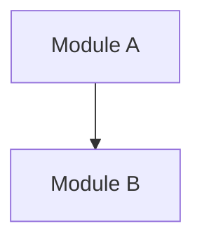

# Module Map

## 1. Document Positioning

本文件用于维护当前产品的模块总览，帮助团队快速判断：

- 当前产品已经有哪些模块
- 每个模块的状态是什么
- 模块最早来自哪个版本
- 模块应当到哪份主档中查看详细说明

## 2. Status Definition

- `Planned`: 已识别，但尚未进入稳定主档
- `Active`: 已进入当前主档，并处于有效范围内
- `Conditional`: 已定义，但只在特定场景触发
- `Deferred`: 已提出，但暂不纳入当前主流程
- `Retired`: 已不再使用

## 3. Module Overview

| Module | Status | Purpose | First Version | Detail Source |
| :--- | :--- | :--- | :--- | :--- |
| TBD | Planned | TBD | TBD | TBD |

## 4. Module Relationship View

## 5. Module Grouping

### 5.1 Access and Authentication

- TBD

### 5.2 Identity and Routing

- TBD

### 5.3 Future Enhancement

- TBD

## 6. Maintenance Rules

- 当新增稳定模块进入主档时，必须同步更新本文件。
- 当模块状态从 `Planned` 变为 `Active`，或从 `Active` 变为 `Retired` 时，必须记录变更。
- 当某模块被拆分为多个子模块时，应保留原模块记录并新增子模块条目。

## 7. Current Summary

- Active Modules: TBD
- Conditional Modules: TBD
- Deferred Modules: TBD
- Source Base: TBD
