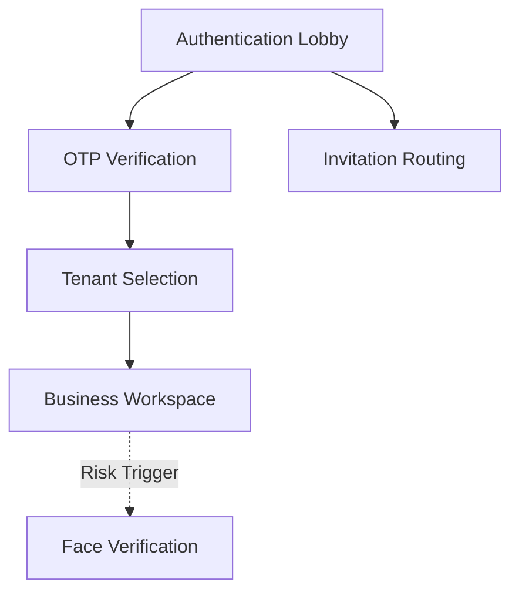

# Module Map

## 1. Document Positioning

本文件用于维护当前产品的模块总览，帮助团队快速判断：

- 当前产品已经有哪些模块
- 每个模块的状态是什么
- 模块最早来自哪个版本
- 模块应当到哪份主档中查看详细说明

## 2. Status Definition

- `Planned`: 已识别，但尚未进入稳定主档
- `Active`: 已进入当前主档，并处于有效范围内
- `Conditional`: 已定义，但只在特定场景触发
- `Deferred`: 已提出，但暂不纳入当前主流程
- `Retired`: 已不再使用

## 3. Module Overview

| Module | Status | Purpose | First Version | Detail Source |
| :--- | :--- | :--- | :--- | :--- |
| Authentication Lobby | Active | 承接未登录用户并分流授权路径 | v1.0 | `PRD_Master.md` |
| OTP Verification | Active | 校验短信验证码并完成放行 | v1.0 | `PRD_Master.md` |
| Face Verification | Conditional | 在风险场景下执行二次安全校验 | v1.0 | `PRD_Master.md` |
| Tenant Selection | Active | 处理多货主身份切换与唯一上下文确认 | v1.0 | `PRD_Master.md` |
| Invitation Routing | Active | 处理邀请来源记录与自动归属 | v1.0 | `PRD_Master.md` |
| First Order Recommendation | Deferred | 在邀请入驻后提供首单建议 | Next | `Decision_Log.md` |

## 4. Module Relationship View

## 5. Module Grouping

### 5.1 Access and Authentication

- Authentication Lobby
- OTP Verification
- Face Verification

### 5.2 Identity and Routing

- Tenant Selection
- Invitation Routing

### 5.3 Future Enhancement

- First Order Recommendation

## 6. Maintenance Rules

- 当新增稳定模块进入主档时，必须同步更新本文件。
- 当模块状态从 `Planned` 变为 `Active`，或从 `Active` 变为 `Retired` 时，必须记录变更。
- 当某模块被拆分为多个子模块时，应保留原模块记录并新增子模块条目。

## 7. Current Summary

- Active Modules: 4
- Conditional Modules: 1
- Deferred Modules: 1
- Source Base: `v1.0`
