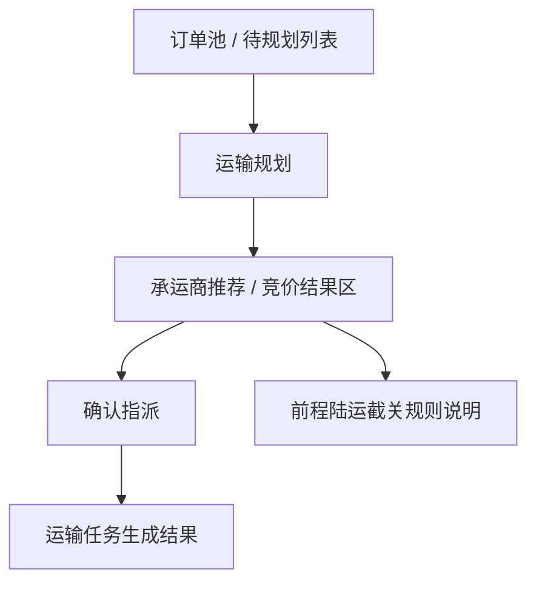

# Module Map

## 1. 文档定位

本文件用于维护当前产品的模块总览，方便快速判断：

- 当前产品有哪些模块
- 每个模块当前状态是什么
- 每个模块最早来自哪个版本
- 每个模块应到哪份主档查看详情

填写建议：

- 先录入当前版本最核心的主线模块
- 再补支撑模块和扩展模块
- 避免在模板阶段一次性写太多占位模块

## 2. 状态定义

- `规划中`: 已识别，但尚未进入稳定主档
- `已启用`: 已进入当前主档，并处于有效范围内
- `条件启用`: 已定义，但只在特定场景触发
- `暂缓`: 已提出，但暂不纳入当前主流程
- `已退役`: 已不再使用

## 3. 模块总览

| 模块名称 | 状态 | 作用 | 首次版本 | 详情来源 |
| :--- | :--- | :--- | :--- | :--- |
| 订单池 / 待规划列表 | 已启用 | 承接待规划订单并作为运输规划入口 | v1.0 | `Product_Architecture.md` |
| 运输规划 | 已启用 | 识别约束并给出 FTL / LTL 判断 | v1.0 | `Product_Architecture.md` |
| 承运商推荐 / 竞价结果区 | 已启用 | 展示候选承运商及推荐依据 | v1.0 | `Product_Architecture.md` |
| 前程陆运截关规则说明 | 条件启用 | 说明性支线规则，触发候选降级 | v1.0 | `Product_Architecture.md` |
| 确认指派 | 已启用 | 由调度员完成最终承运确认 | v1.0 | `Product_Architecture.md` |
| 运输任务生成结果 | 已启用 | 显示任务生成结果和异常反馈 | v1.0 | `Product_Architecture.md` |

## 4. 模块关系图

## 5. 模块分组

### 5.1 核心主线模块

- 订单池 / 待规划列表
- 运输规划
- 承运商推荐 / 竞价结果区
- 确认指派
- 运输任务生成结果

### 5.2 支撑与辅助模块

- 前程陆运截关规则说明
- 竞价 / 招标备选分支
- 异常反馈与部分成功说明

### 5.3 后续扩展模块

- 司机执行端
- 在途监控
- 签收回单
- 费率对账

## 6. 维护规则

- 当新增稳定模块进入主档时，必须同步更新本文件
- 当模块状态从 `规划中` 变为 `已启用`，或从 `已启用` 变为 `已退役` 时，必须记录变更
- 当某模块被拆分为多个子模块时，应保留原模块记录并新增子模块条目

## 7. 当前摘要

- 已启用模块数：5
- 条件启用模块数：1
- 暂缓模块数：4
- 当前来源版本：v1.0
