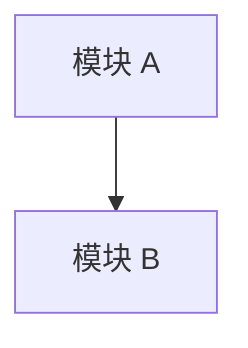

# Module Map

## 1. 文档定位

本文件用于维护当前产品的模块总览，方便快速判断：

- 当前产品有哪些模块
- 每个模块当前状态是什么
- 每个模块最早来自哪个版本
- 每个模块应到哪份主档查看详情

填写建议：

- 先录入当前版本最核心的主线模块
- 再补支撑模块和扩展模块
- 避免在模板阶段一次性写太多 TBD 模块

## 2. 状态定义

- `Planned`: 已识别，但尚未进入稳定主档
- `Active`: 已进入当前主档，并处于有效范围内
- `Conditional`: 已定义，但只在特定场景触发
- `Deferred`: 已提出，但暂不纳入当前主流程
- `Retired`: 已不再使用

## 3. 模块总览

| 模块名称 | 状态 | 作用 | 首次版本 | 详情来源 |
| :--- | :--- | :--- | :--- | :--- |
| TBD | Planned | TBD | TBD | TBD |

## 4. 模块关系图

## 5. 模块分组

### 5.1 核心主线模块

- TBD

### 5.2 支撑与辅助模块

- TBD

### 5.3 后续扩展模块

- TBD

## 6. 维护规则

- 当新增稳定模块进入主档时，必须同步更新本文件
- 当模块状态从 `Planned` 变为 `Active`，或从 `Active` 变为 `Retired` 时，必须记录变更
- 当某模块被拆分为多个子模块时，应保留原模块记录并新增子模块条目

## 7. 当前摘要

- Active Modules: TBD
- Conditional Modules: TBD
- Deferred Modules: TBD
- Source Base: TBD
