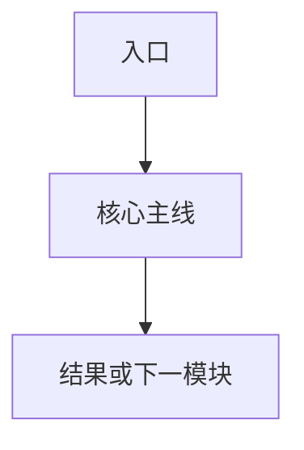

# PRD Master

## 1. 文档定位

本文件用于沉淀跨版本稳定下来的业务规则、模块定义和全局需求说明。

适用原则：

- 只写稳定结论
- 不写临时草稿
- 不写未定稿讨论

填写建议：

- 先补产品概述和角色定义
- 再补核心模块和全局规则
- 最后补跨模块依赖和版本合并记录

## 2. 修订记录

| 日期 | 版本 | 更新范围 | 更新说明 | 负责人 |
| :--- | :--- | :--- | :--- | :--- |
| 待填写 | 待填写 | 待填写 | 初始化主档骨架 | 待填写 |

## 3. 产品概述

### 3.1 产品名称
- 中文名：
- 英文名：
- 内部简称：

### 3.2 产品目标
- 核心要解决的问题：
- 核心目标用户：
- 业务价值：

### 3.3 产品边界
- 当前包含：
- 当前不包含：

## 4. 角色定义

| 角色 | 说明 | 核心任务 | 关键权限或边界 |
| :--- | :--- | :--- | :--- |
| 待填写 | 待填写 | 待填写 | 待填写 |

## 5. 核心模块

### 5.1 模块总览

| 模块名称 | 作用 | 当前状态 | 首次进入版本 |
| :--- | :--- | :--- | :--- |
| 待填写 | 待填写 | 待填写 | 待填写 |

### 5.2 模块说明

#### 模块：待填写
- 业务目的：
- 触发场景：
- 核心动作：
- 预期结果：
- 异常基线：

## 6. 全局旅程

## 7. 全局规则

### 7.1 角色与访问
- 规则 1：
- 规则 2：

### 7.2 数据与状态
- 规则 1：
- 规则 2：

### 7.3 异常与边界
- 规则 1：
- 规则 2：

## 8. 跨模块依赖

| 模块 A | 模块 B | 依赖类型 | 说明 |
| :--- | :--- | :--- | :--- |
| 待填写 | 待填写 | 待填写 | 待填写 |

## 9. 待决事项

| 主题 | 当前状态 | 下一步 | 负责人 |
| :--- | :--- | :--- | :--- |
| 待填写 | 待填写 | 待填写 | 待填写 |

## 10. 版本合并记录

| 版本号 | 合并状态 | 合并范围 | 备注 |
| :--- | :--- | :--- | :--- |
| 待填写 | 待填写 | 待填写 | 待填写 |
