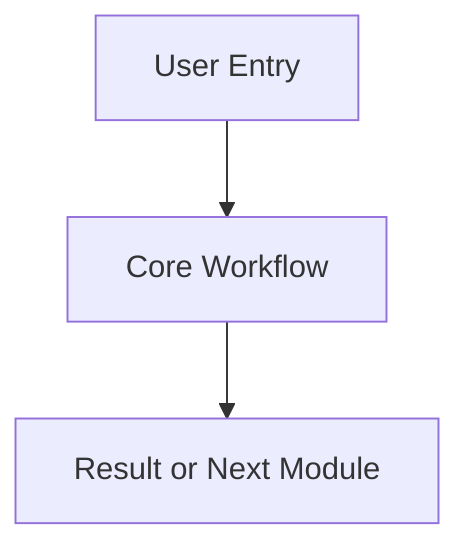

# PRD Master

## 1. Document Positioning

这是产品主 PRD，用于沉淀跨版本稳定结论。

- 记录已经确认的业务规则
- 记录长期有效的页面与模块定义
- 作为迭代版本文档合并后的官方主档

说明：
临时讨论、未定稿方案、草稿性内容不应直接写入本文件。

## 2. Revision Log

| Date | Version | Updated Area | Summary | Owner |
| :--- | :--- | :--- | :--- | :--- |
| TBD | TBD | TBD | Initialize master structure | TBD |

## 3. Product Overview

### 3.1 Product Name
- Chinese Name:
- English Name:
- Internal Short Name:

### 3.2 Product Goal
- Core problem to solve:
- Main target users:
- Business value:

### 3.3 Product Boundary
- Included scope:
- Excluded scope:

## 4. User Roles

| Role | Description | Main Goal | Key Permissions |
| :--- | :--- | :--- | :--- |
| TBD | TBD | TBD | TBD |

## 5. Core Business Modules

### 5.1 Module Map

| Module | Purpose | Current Status | First Introduced In |
| :--- | :--- | :--- | :--- |
| TBD | TBD | TBD | TBD |

### 5.2 Module Details

#### Module: TBD
- Business purpose:
- Trigger scenario:
- Key user action:
- Expected result:
- Exception baseline:

## 6. Global User Journey

## 7. Global Business Rules

### 7.1 Identity and Access
- Rule 1:
- Rule 2:

### 7.2 Data and Status
- Rule 1:
- Rule 2:

### 7.3 Exception Handling Baseline
- Rule 1:
- Rule 2:

## 8. Cross-Module Dependencies

| Module A | Module B | Dependency Type | Notes |
| :--- | :--- | :--- | :--- |
| TBD | TBD | TBD | TBD |

## 9. Open Decisions

| Topic | Current State | Next Action | Owner |
| :--- | :--- | :--- | :--- |
| TBD | TBD | TBD | TBD |

## 10. Iteration Merge Record

| Iteration Version | Merge Status | Merge Scope | Notes |
| :--- | :--- | :--- | :--- |
| TBD | TBD | TBD | TBD |
