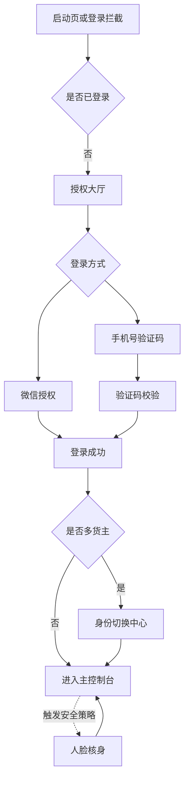

# PRD Master

## 1. Document Positioning

这是产品主 PRD，用于沉淀跨版本稳定结论。

- 记录已经确认的业务规则
- 记录长期有效的页面与模块定义
- 作为迭代版本文档合并后的官方主档

说明：
临时讨论、未定稿方案、草稿性内容不应直接写入本文件。

## 2. Revision Log

| Date | Version | Updated Area | Summary | Owner |
| :--- | :--- | :--- | :--- | :--- |
| 2026-05-19 | v0.1 | Master document structure | Initialize master structure | OpenCode |
| 2026-05-19 | v1.0 merge | Authentication and tenant routing | Merge stable conclusions from iteration v1.0 | OpenCode |

## 3. Product Overview

### 3.1 Product Name
- Chinese Name: TMS_Shipper 司机端鉴权与业务归属分发模块
- English Name: TMS_Shipper Driver Authentication and Tenant Routing
- Internal Short Name: TMS_Shipper Auth

### 3.2 Product Goal
- Core problem to solve: 为物流司机提供可控、可追溯的登录、身份确认和货主归属选择流程。
- Main target users: 使用微信小程序接单或待入驻的司机用户。
- Business value: 降低错归属、代操作和登录流失风险，确保司机进入正确的货主工作上下文。

### 3.3 Product Boundary
- Included scope: 微信授权登录、手机号验证码登录、邀请链接溯源、司机自动归属、多货主身份切换、人脸核身触发逻辑。
- Excluded scope: 司机详细资料维护、证件 OCR、货主端后台审核、多语言支持。

## 4. User Roles

| Role | Description | Main Goal | Key Permissions |
| :--- | :--- | :--- | :--- |
| Driver | 司机端用户 | 完成登录并进入正确货主工作流 | 登录、验证、选择货主、进入业务上下文 |
| Invited Driver | 通过邀请链接进入的司机 | 完成注册并自动绑定邀请来源货主 | 登录、注册、自动归属、后续进入身份判断 |
| Tenant Admin | 货主侧管理角色 | 管理司机归属资格 | 不在当前模块直接操作，但其变更会影响准入状态 |

## 5. Core Business Modules

### 5.1 Module Map

| Module | Purpose | Current Status | First Introduced In |
| :--- | :--- | :--- | :--- |
| Authentication Lobby | 承接未登录用户并分流授权路径 | Active | v1.0 |
| OTP Verification | 校验短信验证码并完成放行 | Active | v1.0 |
| Face Verification | 在高风险场景执行活体验证 | Conditional | v1.0 |
| Tenant Selection | 处理多货主身份切换与唯一上下文确认 | Active | v1.0 |
| Invitation Routing | 处理邀请链接溯源与自动归属 | Active | v1.0 |

### 5.2 Module Details

#### Module: Authentication Lobby
- Business purpose: 承接首次进入和掉线后的登录拦截，完成微信授权或手机号登录分流。
- Trigger scenario: 用户未登录进入小程序，或现有登录态失效。
- Key user action: 选择微信一键授权，或切换到手机号验证码流程。
- Expected result: 用户完成授权或进入验证码校验流程。
- Exception baseline: 未勾选协议不得继续授权；网络异常和验证码超频必须明确提示。

#### Module: OTP Verification
- Business purpose: 通过短信验证码完成安全放行。
- Trigger scenario: 用户选择手机号登录并成功发起验证码发送。
- Key user action: 输入 6 位验证码并完成校验。
- Expected result: 校验通过后进入下一步身份判断或主流程。
- Exception baseline: 凭证失效、高频错误和异常锁定必须有明确定义的反馈文案。

#### Module: Face Verification
- Business purpose: 在触发安全策略时确认操作者为本人。
- Trigger scenario: 系统判定需要执行二次安全校验。
- Key user action: 按要求完成活体采集。
- Expected result: 验证通过后回到原业务路径。
- Exception baseline: 摄像头不可用或验证失败时必须提供降级路径或重试机制。

#### Module: Tenant Selection
- Business purpose: 让属于多个货主的司机明确当前工作归属。
- Trigger scenario: 登录成功后识别到用户存在多个货主身份。
- Key user action: 选择目标货主卡片并确认进入。
- Expected result: 建立唯一上下文并进入对应业务首页。
- Exception baseline: 若归属资格刚被移除，必须阻断进入并给出明确说明。

#### Module: Invitation Routing
- Business purpose: 通过邀请链路记录来源并在注册完成后自动归属。
- Trigger scenario: 用户通过带邀请标识的路径首次进入。
- Key user action: 完成登录或注册闭环。
- Expected result: 用户自动绑定为邀请来源货主名下司机。
- Exception baseline: 邀请标识不可在登录前丢失，需持续保留至闭环完成。

## 6. Global User Journey

## 7. Global Business Rules

### 7.1 Identity and Access
- 不支持游客模式，未登录用户必须停留在登录拦截区域。
- 微信授权与手机号验证码登录为并行可切换入口。
- 用户未勾选隐私或授权协议时，不得继续执行授权动作。
- 若触发安全策略，必须进入人脸核身流程后方可继续。

### 7.2 Data and Status
- 用户信息必须与后端保持同步，确保跨端身份状态一致。
- 登录成功后必须立即判断是否存在多货主身份。
- 若用户通过邀请链路进入，邀请来源信息需保留至注册闭环完成。
- 当用户完成货主选择后，当前货主上下文必须被唯一确认并用于后续业务流。

### 7.3 Exception Handling Baseline
- 验证码超频、网络异常、验证码失效、风险锁定等场景必须有标准反馈文案。
- 人脸核身失败、摄像头不可用、货主归属失效等场景必须提供阻断或降级方案。
- 拒绝微信手机号授权时不得直接崩溃，应提供软引导降级路径。

## 8. Cross-Module Dependencies

| Module A | Module B | Dependency Type | Notes |
| :--- | :--- | :--- | :--- |
| Authentication Lobby | OTP Verification | 登录路径衔接 | 手机号路径进入验证码校验 |
| Authentication Lobby | Invitation Routing | 来源溯源 | 邀请标识在登录前后需持续保留 |
| OTP Verification | Tenant Selection | 放行后路由 | 校验通过后判断是否多货主 |
| Face Verification | Tenant Selection | 安全补强 | 风险策略通过后恢复原业务流程 |
| Tenant Selection | Core Business Workspace | 工作上下文确认 | 当前货主选择决定后续业务归属 |

## 9. Open Decisions

| Topic | Current State | Next Action | Owner |
| :--- | :--- | :--- | :--- |
| 人脸核身落地方式 | 待确认 | 明确采用原生能力还是第三方方案 | Product / Security |
| 邀请链路持久化策略 | 已有方向 | 在注册闭环前保持邀请来源不丢失 | Product |
| 首单建议能力 | 候选扩展 | 评估是否将邀请入驻与推荐派单联动 | Product |

## 10. Iteration Merge Record

| Iteration Version | Merge Status | Merge Scope | Notes |
| :--- | :--- | :--- | :--- |
| v1.0 | Merged | 登录鉴权、验证码、人脸核身、多货主切换、邀请归属 | Stable conclusions merged on 2026-05-19 |
