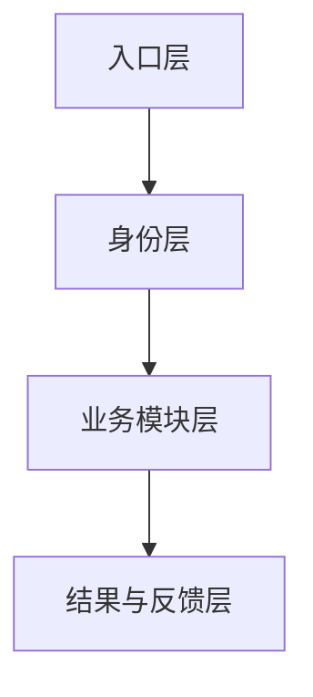
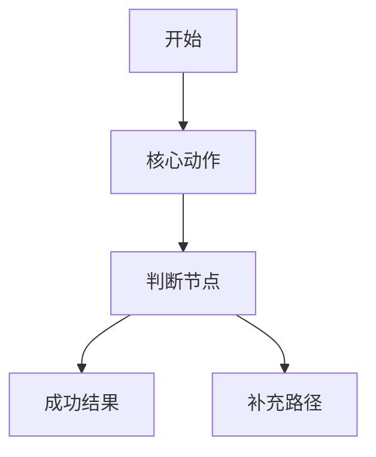
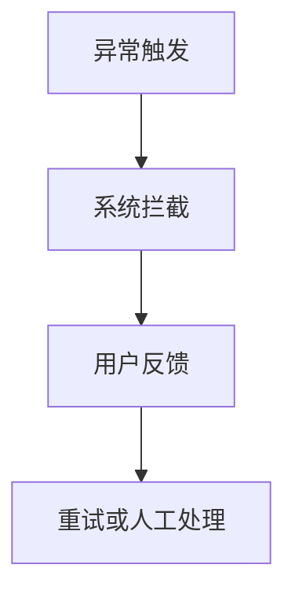
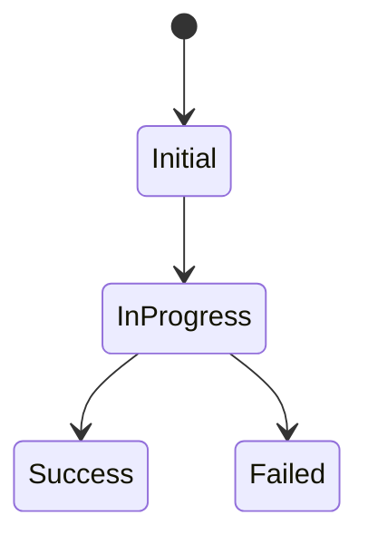

# Product Architecture

## 1. 文档定位

本文件用于沉淀产品结构、模块关系、核心流程和依赖拓扑。

说明：
这里的“架构”以产品信息架构和业务关系为主，不要求写成研发部署文档。

填写建议：

- 先补产品拓扑和模块关系
- 再补主流程、异常流程和状态视图
- 最后补外部依赖和架构约束

## 2. 修订记录

| 日期 | 版本 | 更新范围 | 更新说明 | 负责人 |
| :--- | :--- | :--- | :--- | :--- |
| 待填写 | 待填写 | 待填写 | 初始化架构骨架 | 待填写 |

## 3. 架构范围

- 当前覆盖范围：
- 当前模块范围：
- 当前不包含：

## 4. 产品拓扑

## 5. 模块关系

| 模块 | 上游 | 下游 | 关键依赖 |
| :--- | :--- | :--- | :--- |
| 待填写 | 待填写 | 待填写 | 待填写 |

## 6. 核心流程

### 6.1 主流程

### 6.2 异常流程

## 7. 状态视图

## 8. 外部依赖

| 依赖对象 | 类型 | 作用 | 风险说明 |
| :--- | :--- | :--- | :--- |
| 待填写 | 待填写 | 待填写 | 待填写 |

## 9. 架构约束

- 约束 1：
- 约束 2：
- 约束 3：

## 10. 后续扩展备注

- 潜在新增模块：
- 潜在新增依赖：
- 可能的结构影响：
