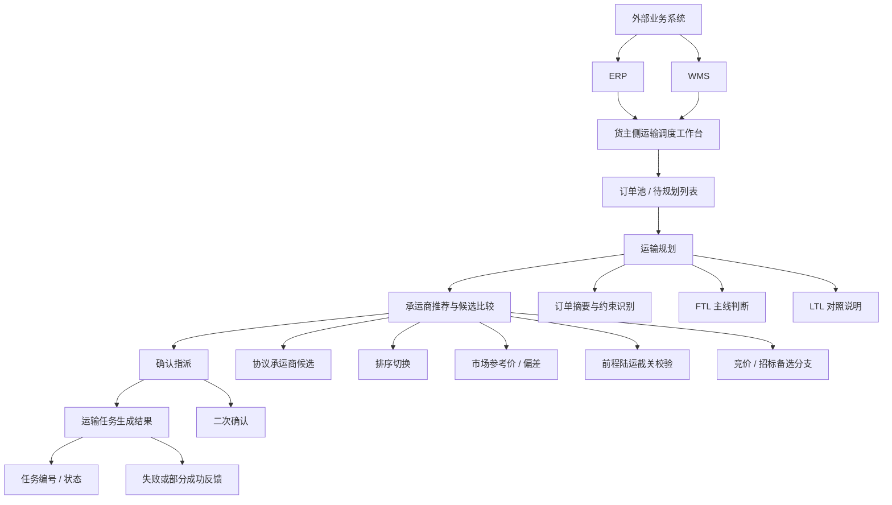
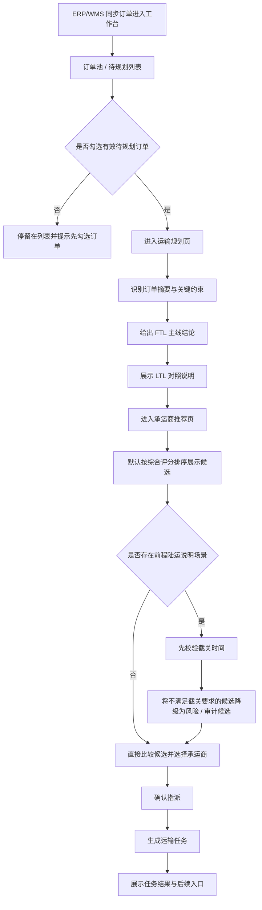
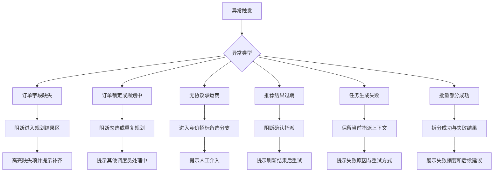
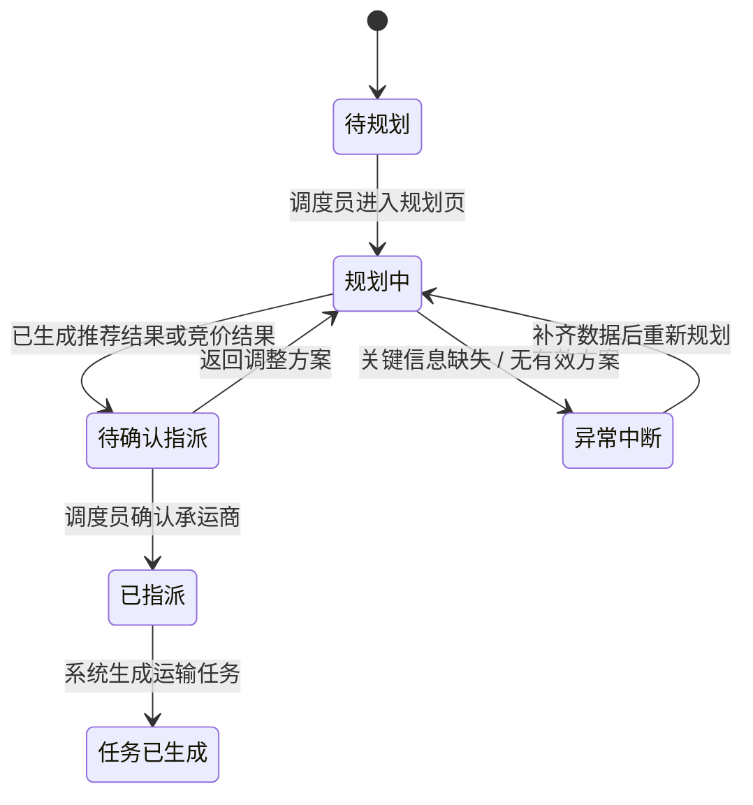

# Product Architecture

## 1. 文档定位

本文件用于沉淀产品结构、模块关系、核心流程和依赖拓扑。

说明：
这里的“架构”以产品信息架构和业务关系为主，不要求写成研发部署文档。

填写建议：

- 先补产品拓扑和模块关系
- 再补主流程、异常流程和状态视图
- 最后补外部依赖和架构约束

## 2. 修订记录

| 日期 | 版本 | 更新范围 | 更新说明 | 负责人 |
| :--- | :--- | :--- | :--- | :--- |
| 2026-05-27 | v1.0 | 订单到承运商指派闭环 | 基于 `v1.0` 沉淀货主侧国内陆运主线架构 | Bale / OpenCode |

## 3. 架构范围

- 当前覆盖范围：货主侧国内陆运订单到承运商指派闭环
- 当前模块范围：订单接入、运输规划、承运商推荐、确认指派、任务结果反馈
- 当前不包含：司机执行、在途监控、签收回单、费率对账、经营分析

## 4. 产品拓扑

## 5. 模块关系

| 模块 | 上游 | 下游 | 关键依赖 |
| :--- | :--- | :--- | :--- |
| ERP/WMS 订单输入 | 外部业务系统 | 订单池 / 待规划列表 | 待规划订单同步 |
| 订单池 / 待规划列表 | ERP/WMS 订单输入 | 运输规划 | 订单状态、筛选条件 |
| 运输规划 | 订单池 / 待规划列表 | 承运商推荐与候选比较 | 订单摘要、重量体积、时效要求 |
| 承运商推荐与候选比较 | 运输规划 | 确认指派 | 综合评分、报价、市场参考价、规则校验 |
| 确认指派 | 承运商推荐与候选比较 | 运输任务生成结果 | 承运商选择、时效承诺 |
| 运输任务生成结果 | 确认指派 | 后续任务查看入口 | 任务编号、状态、异常反馈 |

## 6. 核心流程

### 6.1 主流程

### 6.2 异常流程

异常流程说明：

- 若订单关键字段缺失，系统必须阻断进入有效规划结果，并在规划页高亮缺失项，引导用户先补齐数据。
- 若订单已处于 `规划中` 或被其他调度员锁定，系统必须阻断重复勾选和重复规划，并明确提示当前由其他人处理中。
- 若无符合条件的协议承运商，系统不应继续沿默认推荐主线推进，而应切换至竞价 / 招标备选分支，或提示人工介入。
- 若推荐结果已过期或被他人更新，系统必须阻断确认指派动作，并要求用户刷新推荐结果后重新确认。
- 若运输任务生成失败，系统需保留当前指派上下文，明确反馈失败原因，并提供重试或人工处理入口。
- 若批量指派出现部分成功、部分失败，系统需拆分展示成功结果和失败摘要，避免只给出笼统失败提示。

## 7. 状态视图

## 8. 外部依赖

| 依赖对象 | 类型 | 作用 | 风险说明 |
| :--- | :--- | :--- | :--- |
| ERP | 外部业务系统 | 提供待规划订单来源 | 订单同步时效和字段完整性 |
| WMS | 外部业务系统 | 提供仓储侧发货需求来源 | 发货状态与字段一致性 |

## 9. 架构约束

- 约束 1：只服务货主侧调度员，不扩货代 / 承运商独立后台。
- 约束 2：前程陆运仅作为说明性支线，优先停留在承运商推荐页的规则说明与候选降级逻辑中。
- 约束 3：被规则拦截的候选可保留为风险或审计候选，但不得与默认推荐候选平级。

## 10. 后续扩展备注

- 潜在新增模块：司机执行端、在途监控、签收回单、费率对账
- 潜在新增依赖：定位平台、回单系统、财务结算模块
- 可能的结构影响：若后续扩展执行闭环，结果层需向执行层继续分叉，而当前 `v1.0` 保持收口
