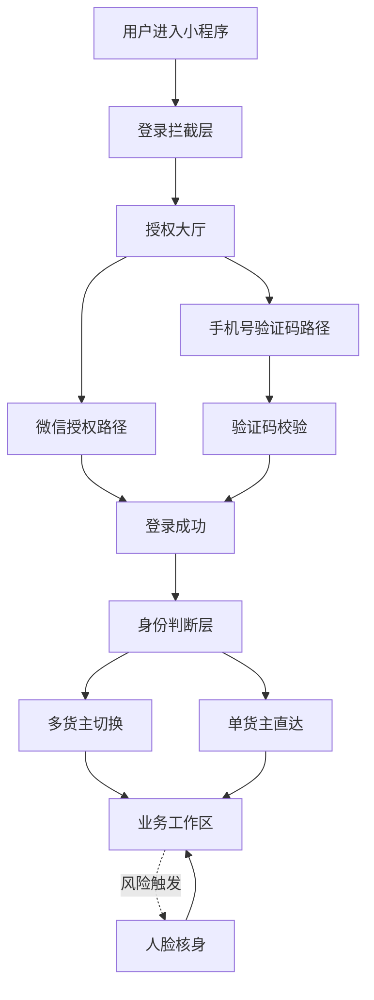
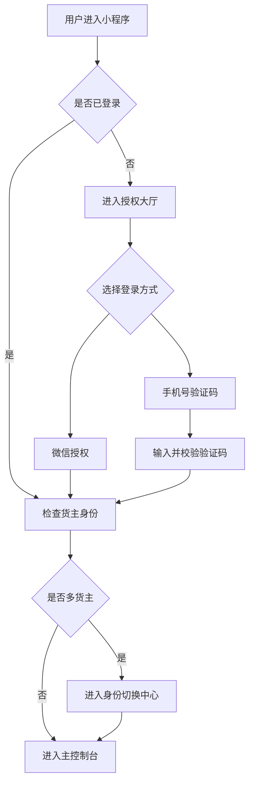
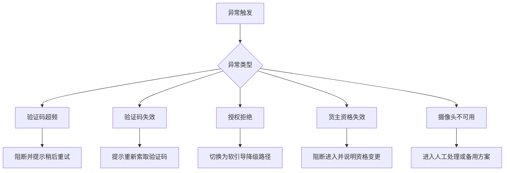
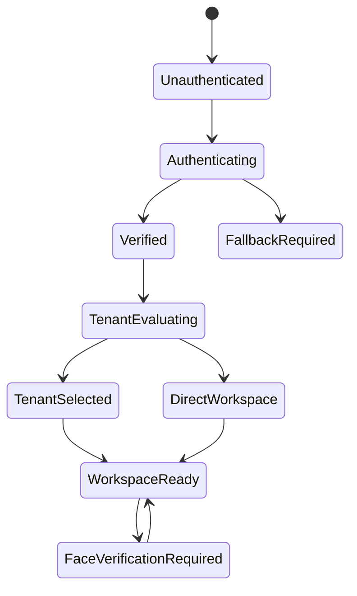

# Product Architecture

## 1. Document Positioning

这是产品级架构文档，用于沉淀系统结构、模块关系、关键流程和依赖拓扑。

说明：
这里的“架构”以产品信息架构和业务关系为主，不要求写成研发部署文档。

## 2. Revision Log

| Date | Version | Updated Area | Summary | Owner |
| :--- | :--- | :--- | :--- | :--- |
| 2026-05-19 | v0.1 | Architecture structure | Initialize architecture structure | OpenCode |
| 2026-05-19 | v1.0 merge | Authentication and tenant routing | Merge stable v1.0 module topology and flows | OpenCode |

## 3. Architecture Scope

- Current product scope: 微信小程序司机端的登录、身份确认、邀请归属和货主上下文选择。
- Covered business modules: 授权大厅、验证码校验、人脸核身、邀请归属、多货主切换。
- Out-of-scope areas: 司机资料维护、证件识别、货主后台审核、多语言能力。

## 4. Product Topology

## 5. Module Relationship

| Module | Upstream | Downstream | Key Dependency |
| :--- | :--- | :--- | :--- |
| Authentication Lobby | User Entry | OTP Verification / WeChat Authorization | 登录入口分流 |
| OTP Verification | Authentication Lobby | Tenant Evaluation | 手机号登录放行 |
| Invitation Routing | User Entry | Authentication Lobby / Tenant Evaluation | 邀请来源在登录闭环前保留 |
| Tenant Evaluation | Login Success | Tenant Selection / Direct Entry | 根据归属数量决定下一步 |
| Tenant Selection | Tenant Evaluation | Business Workspace | 唯一确定当前货主上下文 |
| Face Verification | Business Workspace | Business Workspace | 风险触发后完成核身再恢复流程 |

## 6. Core Flows

### 6.1 Primary Flow

### 6.2 Exception Flow

## 7. State Management View

## 8. External Dependencies

| Dependency | Type | Why Needed | Risk Note |
| :--- | :--- | :--- | :--- |
| WeChat Authorization | Platform capability | 提供微信授权登录入口 | 受平台能力和授权链路限制 |
| SMS Gateway | External service | 下发和校验短信验证码 | 存在超频、延迟、失败风险 |
| Face Verification Service | External or platform capability | 执行活体与身份校验 | 资质、硬件和接入方式需确认 |
| Backend User Service | Internal dependency | 同步用户身份、货主归属与登录状态 | 必须保证跨端数据一致 |

## 9. Architecture Constraints

- 不支持游客进入，所有业务路径以登录作为前置门禁。
- 货主上下文必须唯一确认后才能进入正式工作流。
- 异常路径必须具备可执行的反馈或降级方案，不能出现断路状态。

## 10. Future Expansion Notes

- Potential new module: 邀请注册后的首单推荐或自动化入驻引导。
- Potential dependency: 若接入更强身份能力，可能引入新的认证或风控服务。
- Potential structural impact: 未来若引入货主端联动审核，身份判断层与归属判断层将进一步拆分。
