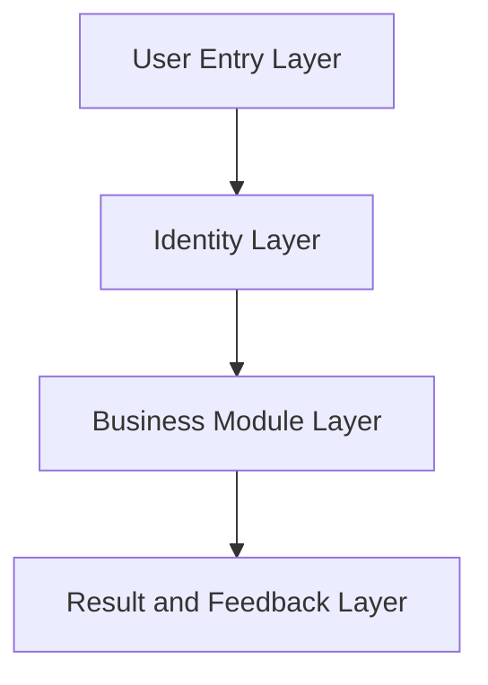
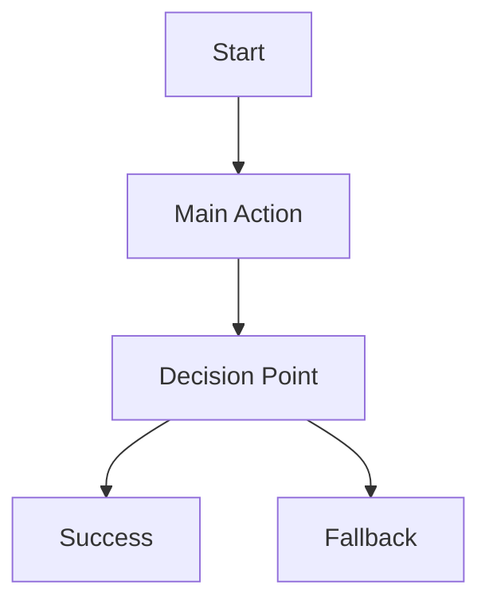
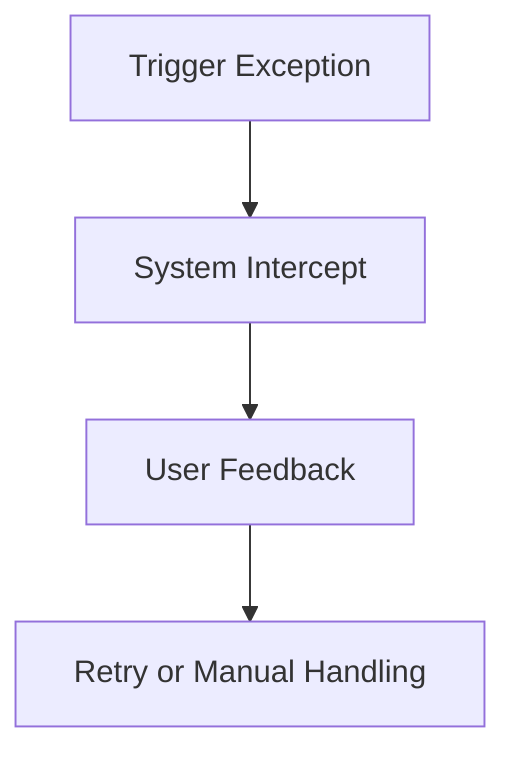
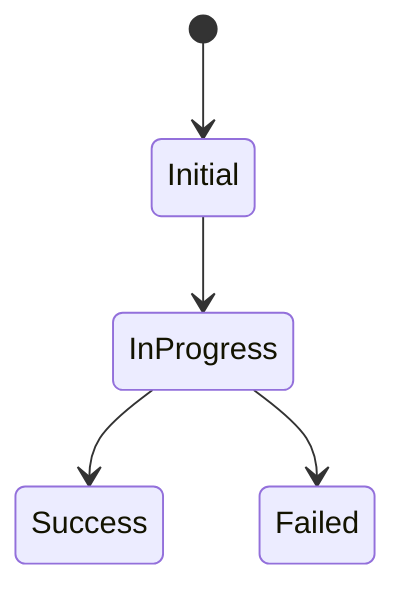

# Product Architecture

## 1. Document Positioning

这是产品级架构文档，用于沉淀系统结构、模块关系、关键流程和依赖拓扑。

说明：
这里的“架构”以产品信息架构和业务关系为主，不要求写成研发部署文档。

## 2. Revision Log

| Date | Version | Updated Area | Summary | Owner |
| :--- | :--- | :--- | :--- | :--- |
| TBD | TBD | TBD | Initialize architecture structure | TBD |

## 3. Architecture Scope

- Current product scope:
- Covered business modules:
- Out-of-scope areas:

## 4. Product Topology

## 5. Module Relationship

| Module | Upstream | Downstream | Key Dependency |
| :--- | :--- | :--- | :--- |
| TBD | TBD | TBD | TBD |

## 6. Core Flows

### 6.1 Primary Flow

### 6.2 Exception Flow

## 7. State Management View

## 8. External Dependencies

| Dependency | Type | Why Needed | Risk Note |
| :--- | :--- | :--- | :--- |
| TBD | TBD | TBD | TBD |

## 9. Architecture Constraints

- Constraint 1:
- Constraint 2:
- Constraint 3:

## 10. Future Expansion Notes

- Potential new module:
- Potential dependency:
- Potential structural impact:
