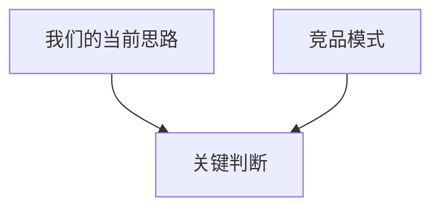

# 02 竞品研究

## 1. 研究目标

- 研究主题：
- 为什么要看：
- 本次要支撑什么决策：

## 2. 竞品快照

| 竞品 | 入口流程 | 关键交互 | 可借鉴点 |
| :--- | :--- | :--- | :--- |
| TBD | TBD | TBD | TBD |

## 3. 交互对比

## 4. 避坑审计

- 坑位 1：
- 坑位 2：
- 坑位 3：

## 5. 差异化建议

1. 
2. 

## 6. 来源记录

- 来源 1：
- 来源 2：

## 7. 小结

- 主要结论：
- 推荐方向：
- 是否可进入下一阶段：
