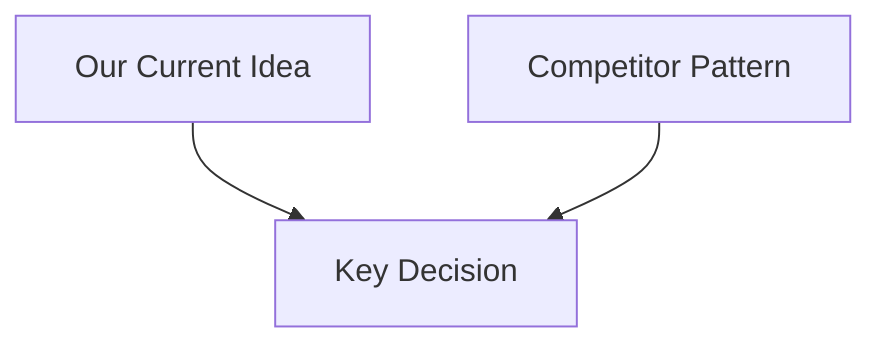

# Phase 2: Competitor Research

## 1. Research Goal

- Research topic:
- Why this matters:
- Decision to support:

## 2. Competitor Snapshot

| Competitor | Entry Flow | Key Interaction | What to Learn |
| :--- | :--- | :--- | :--- |
| TBD | TBD | TBD | TBD |

## 3. Interaction Comparison

## 4. Pitfall Audit

- Pitfall 1:
- Pitfall 2:
- Pitfall 3:

## 5. Differentiation Suggestions

1. 
2. 

## 6. Source Tracking

- Source 1:
- Source 2:

## 7. Summary

- Main conclusion:
- Recommended direction:
- Ready for next phase:
