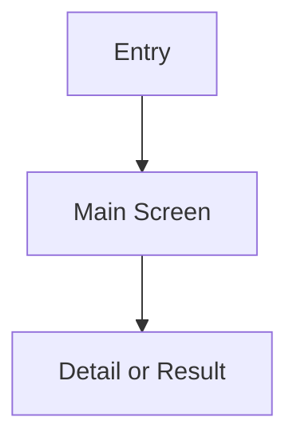

# Phase 3: PRD Initial

## 1. Iteration Goals and Boundaries

### 1.1 Goals
- Goal 1:
- Goal 2:

### 1.2 Boundaries
- Included:
- Excluded:

## 2. Page Topology



## 3. Feature and Interaction List

| Page or Module | Core Interaction | Suggested UI Pattern |
| :--- | :--- | :--- |
| TBD | TBD | TBD |

## 4. Mock Data Shape

```json
{
  "sample": {
    "id": "TBD-001",
    "status": "TBD"
  }
}
```

## 5. Acceptance Criteria

1. 
2. 
3. 

## 6. Summary

- Key interaction locked:
- Open issue:
- Ready for next phase:
