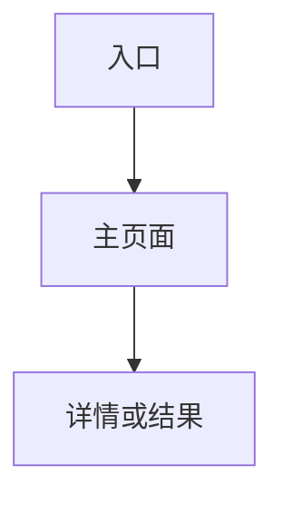

# 03 PRD 初稿

## 1. 本次目标与边界

### 1.1 本次目标
- 目标 1：
- 目标 2：

### 1.2 本次边界
- 包含：
- 不包含：

## 2. 页面拓扑图



## 3. 功能与交互清单

| 页面或模块 | 核心交互 | 推荐页面表达方式 |
| :--- | :--- | :--- |
| TBD | TBD | TBD |

## 4. Mock 数据示例

```json
{
  "sample": {
    "id": "TBD-001",
    "status": "TBD"
  }
}
```

## 5. 验收标准

1. 
2. 
3. 

## 6. 小结

- 当前已锁定内容：
- 当前待补问题：
- 是否可进入下一阶段：
