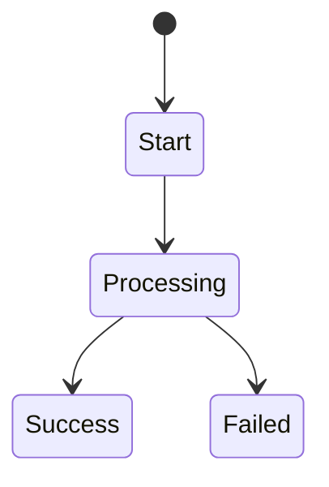

# 05 PRD 终稿

## 1. 文档信息

| 版本 | 日期 | 作者 | 修改说明 | 审核人 |
| :--- | :--- | :--- | :--- | :--- |
| TBD | TBD | TBD | TBD | TBD |

## 2. 业务基线

- 业务目标：
- 必要约束：
- 体验基线：

## 3. 页面或模块详情

### 3.1 范围说明
- 范围描述：

### 3.2 状态流

### 3.3 交互说明
- 触发条件：
- 系统动作：
- 用户反馈：

### 3.4 异常处理矩阵

| 动作 | 触发条件 | 系统处理 | 精确反馈文案 |
| :--- | :--- | :--- | :--- |
| TBD | TBD | TBD | TBD |

## 4. 验收小结

1. 
2. 
3. 

## 5. 修订说明

- 相比初稿：
- 本次主要变化：
- 当前审查状态：
