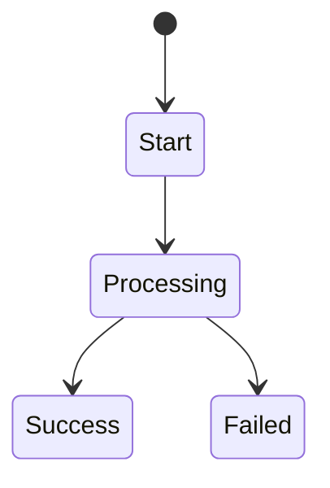

# Phase 5: PRD Final

## 1. Document Info

| Version | Date | Author | Change Summary | Reviewer |
| :--- | :--- | :--- | :--- | :--- |
| TBD | TBD | TBD | TBD | TBD |

## 2. Business Baseline

- Business objective:
- Required constraint:
- Experience baseline:

## 3. Screen or Module Details

### 3.1 Scope
- Scope description:

### 3.2 State Flow

### 3.3 Interaction Details
- Trigger:
- System action:
- User feedback:

### 3.4 Exception Handling Matrix

| Action | Trigger | System Response | Exact Feedback Copy |
| :--- | :--- | :--- | :--- |
| TBD | TBD | TBD | TBD |

## 4. Acceptance Summary

1. 
2. 
3. 

## 5. Revision Notes

- Compared with initial PRD:
- Main changes:
- Final approval state:
