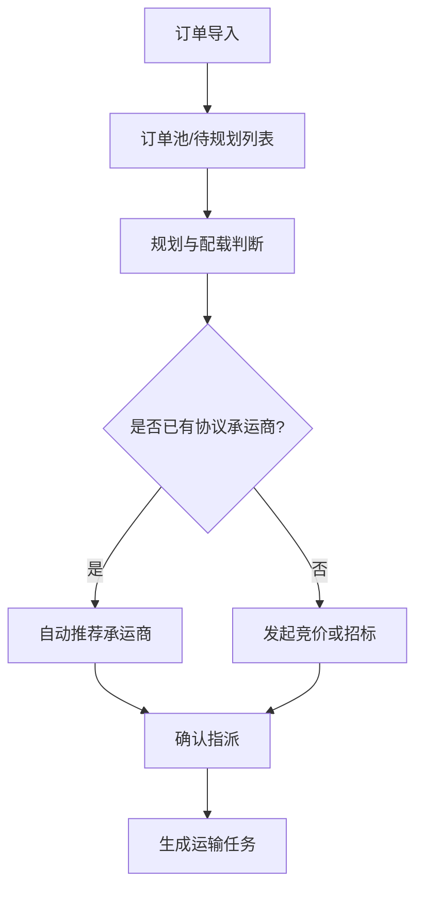

# 02 竞品研究

## 1. 研究目标

- 研究主题：货主侧用户在订单进入系统后，如何完成承运商选择、运力匹配与任务指派。
- 为什么要看：本次 `v1.0` demo 要优先验证“订单到承运商指派闭环”是否讲得清、看得顺、能体现业务价值。
- 本次要支撑什么决策：确认 demo 是否聚焦“订单导入 -> 运输规划 -> 承运商指派”这一条货主侧主线，以及需要突出哪些页面和判断点。

## 2. 竞品快照

| 竞品 | 入口流程 | 关键交互 | 可借鉴点 |
| :--- | :--- | :--- | :--- |
| Oracle Transportation Management | 订单导入后进入运输规划工作台，再做承运商选择与运单生成 | 强调规则驱动规划、费率匹配、批量分派 | 适合借鉴“规划先行，再做指派”的主线表达 |
| Blue Yonder TMS | 从订单池进入计划视图，按运力和路线进行批量编排 | 强调批量处理、计划板、例外提示 | 适合借鉴“订单池 + 批量指派”的操作方式 |
| SAP TM | 从 Freight Unit 到 Freight Order 的计划链路清晰 | 强调对象关系和状态流转 | 适合借鉴“业务对象层级清楚”的表达方式 |
| 4PL / 物流控制塔类产品 | 从订单汇总视图进入承运商协同分派 | 强调承运商网络协同和可视化监控 | 适合借鉴“货主视角的控制塔入口” |

## 3. 交互对比

## 4. 避坑审计

- 坑位 1：一上来就让货主用户在订单明细里逐单找承运商，缺少“订单池 -> 规划 -> 指派”的工作流分层，导致 demo 看起来像手工操作堆砌。
- 坑位 2：只展示承运商列表，不展示推荐依据（费率、时效、线路、历史履约），会让“智能指派”缺乏可信度。
- 坑位 3：批量编排和异常拆单逻辑不清，会让真实业务中高频的合单、拆单、改派无法顺畅承接。

## 5. 差异化建议

1. 本次 demo 应突出“货主控制塔视角”：订单先进订单池，再进入规划判断，而不是直接跳到承运商选择。
2. 在承运商推荐环节，应至少展示 2 到 3 个关键依据，例如：成本、时效、运力可用性，让指派动作更像决策而不是点按钮。

## 6. 来源记录

- 来源 1：Oracle Transportation Management / SAP TM / Blue Yonder TMS 的公开产品资料与常见流程结构。
- 来源 2：你提供的《货主版运输管理系统（Shipper TMS）核心功能模块设计全案》文本材料。

## 7. 小结

- 主要结论：本次 `v1.0` 最适合展示的主线是“货主订单池 -> 运输规划 -> 承运商推荐/竞价 -> 确认指派 -> 生成运输任务”。
- 推荐方向：下一阶段 PRD 初稿应围绕“订单管理与智能编排”以及“运输规划与调度优化”两个货主侧模块展开页面拓扑和交互清单。
- 是否可进入下一阶段：可以进入下一阶段，建议直接开始 `03_PRD_Initial.md`，并聚焦“订单到承运商指派闭环”。
