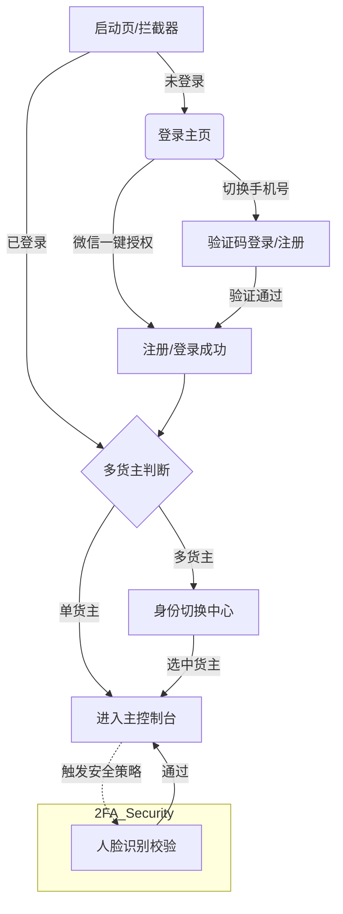

# 📝 Phase 3: 需求初稿蓝图 (Initial PRD) - v1.0

> **角色挂载**：[Lead] 资深产品架构师 & [Staff] 资深前端研发大佬
> **项目名称**：TMS_Shipper 微信小程序登录注册模块
> **状态**：Draft (等待 Phase 4 渲染)

---

## 1. 迭代目标与业务边界 (Iteration Goals)

### 1.1 本次迭代目标 (Goals)
- 实现基于微信生态的“秒级”登录与注册闭环。
- 建立“邀请-绑定-归属”的司机入驻自动化逻辑。
- 解决 B2B 场景下一人隶属于多个货主的身份冲突与切换问题。

### 1.2 业务边界 (Boundaries)
- **Included**: 微信授权、短信验证码、人脸识别(2FA 逻辑点)、多货主切换页面、邀请链接解析。
- **Excluded**: 司机个人详细资料修改（实名认证后的证件 OCR）、货主端后台审核流、多语言支持（本版仅中文）。

---

## 2. 页面结构拓扑图 (Page Topology)



---

## 3. 功能点交互清单 (Feature & AntD Mapping)

| 页面/模块 | 核心交互逻辑 | 推荐 AntD (v5) / 移动端组件 |
| :--- | :--- | :--- |
| **登录主页** | 包含 Logo, 微信一键授权按钮 (Primary), 手机号验证码切换链接。 | `Button (type="primary", block)`, `Form`, `Checkbox` (协议勾选) |
| **手机验证码页** | 字段：手机号、6位验证码（支持倒计时）、协议确认。 | `Input (type="tel")`, `Button` (倒计时插件), `Toast` |
| **人脸核身模块** | 独立全屏组件。包含：扫脸前信息确认、活体检测采集、核验状态反馈。 | `Modal` (全屏覆盖), `Progress` (环形进度), `Image` (动态引导图) |
| **身份切换中心** | 以列表/卡片形式展示当前关联的所有货主企业，点击即完成上下文切换。 | `List`, `Card`, `Radio.Group` (选中样式), `Spin` (切换中) |
| **邀请承接页** | 自动解析 URL 参数中的 `inviter_id`，登录成功后展示欢迎加入弹窗。 | `Modal`, `Result (status="success")` |
| **软引导降级** | 当用户拒绝 `getPhoneNumber` 授权时，弹出 Modal 引导手动输入或解释必要性。 | `Modal` (高度自定义), `Typography.Text` (红字提示) |

---

## 4. 原型 Mock 数据定义 (Data Shaping)

```json
{
  "user_context": {
    "uid": "U-882931",
    "openid": "owx_0123456789",
    "nickname": "张师傅",
    "avatar": "https://api.dicebear.com/7.x/avataaars/svg?seed=Zhang",
    "current_tenant_id": "T-CORP-001",
    "is_new_user": false
  },
  "tenants": [
    {
      "id": "T-CORP-001",
      "name": "顺丰供应链 (上海总仓)",
      "role": "DRIVER",
      "join_date": "2026-01-15",
      "status": "ACTIVE"
    },
    {
      "id": "T-CORP-005",
      "name": "京东物流 (苏州工业园)",
      "role": "DRIVER (CONTRACTOR)",
      "join_date": "2026-03-20",
      "status": "PENDING_FACE_ID"
    }
  ],
  "invitation_payload": {
    "inviter_org": "菜鸟驿站-华东区",
    "inviter_name": "李经理",
    "target_role": "TRUCK_DRIVER"
  }
}
```

---

### 4.2 人脸识别模块状态定义 (Face ID State)
- **Status 1: Pre-Check**: 检查系统权限、说明核身用途。
- **Status 2: Detecting**: 活体检测进行中（眨眼/张嘴/摇头的动画引导）。
- **Status 3: Verifying**: 数据上传后端/微信服务器比对。
- **Status 4: Result**: 成功（自动关闭并跳转）/ 失败（展示重试或人工介入入口）。

## 5. 验收标准 (Acceptance Criteria - AC)

1. **AC-1**: 若用户通过带 `inviter_id` 的路径进入，注册成功后 `tenants` 列表必须实时增加对应货主节点。
2. **AC-2**: 切换身份时，全局状态 `current_tenant_id` 必须更新，且产生一个明显的 `Loading` 遮罩（至少 500ms）以模拟后端数据重载。
3. **AC-3**: 拒绝微信授权后，系统不崩溃，必须跳转至备用的手机号手动录入表单。

---
**[进度播报]**：需求蓝图已定调。
**下一步准备开启**：**Phase 4 (高保真原型开发)**。
