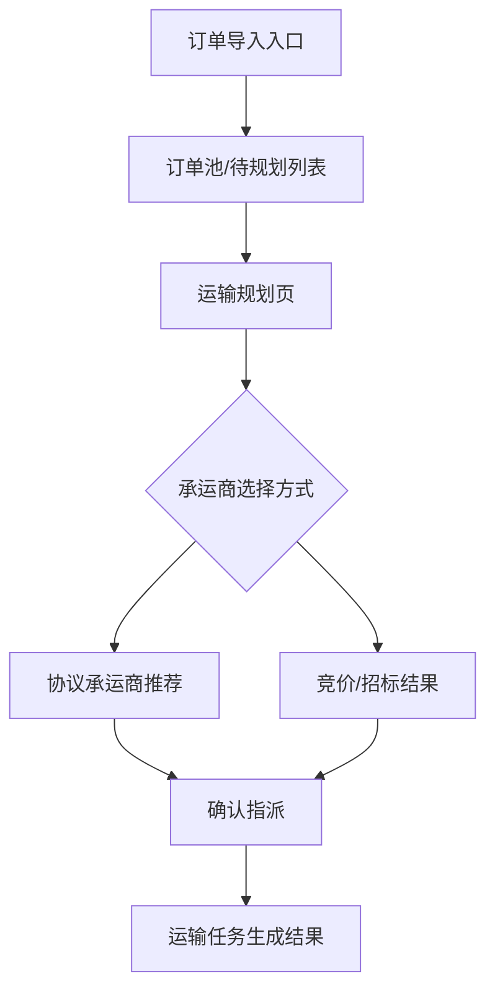

# 03 PRD 初稿

## 1. 本次目标与边界

### 1.1 本次目标
- 目标 1：验证货主侧用户能否在同一条主线中完成“订单导入 -> 运输规划 -> 承运商指派 -> 生成运输任务”。
- 目标 2：让 demo 明确体现货主控制塔视角下的成本、时效和承运商选择依据，而不是只展示页面跳转。

### 1.2 本次边界
- 包含：订单池、待规划列表、运输规划判断、承运商推荐或竞价结果、确认指派、运输任务生成。
- 不包含：货代/承运商独立使用后台、司机执行端完整流程、签收回单闭环、费率对账闭环、长期 BI 经营分析。

## 2. 页面拓扑图



## 3. 功能与交互清单

| 页面或模块 | 核心交互 | 推荐页面表达方式 |
| :--- | :--- | :--- |
| 订单池/待规划列表 | 查看待处理订单、筛选订单、选择订单进入规划 | 列表页 + 筛选区 + 批量选择 |
| 运输规划页 | 查看订单关键信息、判断整车/拆单/合单、确认推荐路径 | 主工作区 + 侧边详情 + 状态提示 |
| 承运商推荐区 | 展示候选承运商及推荐依据（成本、时效、运力可用性） | 推荐卡片或列表对比区 |
| 竞价/招标结果区 | 当无协议承运商或需比价时，展示招标结果或竞价候选 | 对比列表 + 结果说明 |
| 确认指派动作 | 由货主调度员确认承运商与运输任务关系 | 主动作按钮 + 二次确认 |
| 运输任务生成结果 | 指派完成后生成运输任务并返回结果说明 | 结果页或成功反馈面板 |

## 4. Mock 数据示例

```json
{
  "orders": [
    {
      "order_id": "ORD-20260520-001",
      "source": "ERP",
      "delivery_mode": "FTL",
      "pickup_site": "上海嘉定工厂",
      "delivery_site": "苏州工业园客户仓",
      "weight_ton": 8.5,
      "required_arrival_time": "2026-05-21 18:00",
      "status": "TO_PLAN"
    }
  ],
  "carrier_recommendations": [
    {
      "carrier_name": "顺达物流",
      "rate_total": 3200,
      "transit_hours": 10,
      "capacity_status": "AVAILABLE",
      "recommend_reason": "协议价最低，且在承诺时效内"
    },
    {
      "carrier_name": "华东快运",
      "rate_total": 3380,
      "transit_hours": 8,
      "capacity_status": "AVAILABLE",
      "recommend_reason": "时效更优，但成本略高"
    }
  ],
  "bid_results": [
    {
      "carrier_name": "远东供应链",
      "bid_total": 3450,
      "transit_hours": 9,
      "capacity_status": "AVAILABLE",
      "bid_rank": 1,
      "bid_reason": "报价在可接受范围内，且可满足次日到货要求"
    },
    {
      "carrier_name": "联运快线",
      "bid_total": 3580,
      "transit_hours": 8,
      "capacity_status": "AVAILABLE",
      "bid_rank": 2,
      "bid_reason": "时效更优，但成本更高"
    }
  ],
  "dispatch_result": {
    "task_id": "TSK-20260520-001",
    "carrier_name": "顺达物流",
    "status": "ASSIGNED",
    "trace_entry_hint": "后续可继续进入运输执行跟踪"
  }
}
```

## 5. 验收标准

1. 货主调度员可以从订单池中筛选、查看并选定订单进入运输规划流程。
2. 在承运商推荐阶段，系统必须至少展示成本、时效、运力可用性中的 2 到 3 项依据，支撑“为什么推荐这个承运商”。
3. 承运商确认指派后，系统必须明确反馈运输任务已生成，且新任务状态清晰可见。

## 6. 小结

- 当前已锁定内容：本次 `v1.0` 聚焦货主单边使用视角，只验证“订单到承运商指派闭环”。
- 当前待补问题：是否展示竞价/招标分支；是否在任务生成后追加轻量在途跟踪入口；承运商信息的展示深度到什么程度。
- 是否可进入下一阶段：可以进入下一阶段，建议继续补 `04_Prototype_Notes.md` 或直接围绕该主线开始准备 demo 展示结构。
