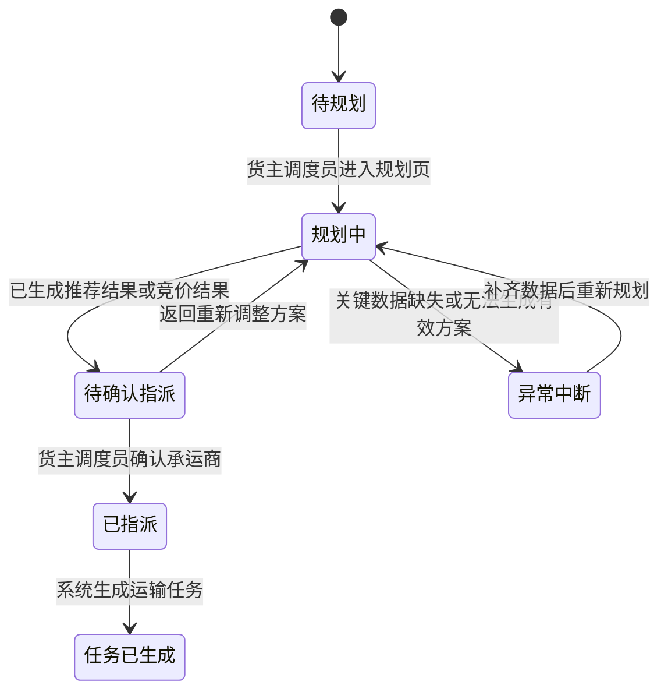

# 05 PRD 终稿

## 1. 文档信息

| 版本 | 日期 | 作者 | 修改说明 | 审核人 |
| :--- | :--- | :--- | :--- | :--- |
| v1.0 | 2026-05-20 | Easton / OpenCode | 收口货主侧“订单到承运商指派闭环”终版需求 | 待确认 |

## 2. 业务基线

- 业务目标：让货主调度员能够在统一工作台内完成订单接收、运输规划、承运商选择与运输任务生成，减少人工分散处理。
- 必要约束：本次只服务货主侧用户，不展开货代/承运商独立后台，不进入司机执行与签收回单闭环。
- 体验基线：页面表达必须围绕“控制塔视角 + 决策闭环”，让用户快速看清订单、推荐依据和指派结果。

## 3. 页面或模块详情

### 3.1 范围说明
- 范围描述：本次终版只覆盖订单池、运输规划页、承运商推荐/竞价结果区、确认指派动作和运输任务生成结果。

### 3.2 状态流

### 3.3 交互说明

- 触发条件：订单从 ERP/WMS 同步进入订单池，状态进入“待规划”。
- 系统动作：系统支持货主调度员筛选订单、进入规划页、查看承运商推荐或竞价结果，并在确认后生成运输任务。
- 用户反馈：每一个关键动作都必须有明确反馈，包括进入规划页、生成推荐结果、确认指派成功、任务生成成功，以及异常阻断时的提示语。

### 3.4 异常处理矩阵

| 动作 | 触发条件 | 系统处理 | 精确反馈文案 |
| :--- | :--- | :--- | :--- |
| 进入运输规划 | 订单关键字段缺失（如提货地、到货地、时效要求） | 阻断进入规划结果区，保留在规划页并高亮缺失项 | `“当前订单信息不完整，无法生成运输方案，请先补齐关键字段。”` |
| 查看承运商推荐 | 无符合条件的协议承运商 | 进入竞价/招标备选分支或提示人工介入 | `“当前无符合条件的协议承运商，请改走竞价或人工指派流程。”` |
| 确认指派 | 推荐结果已过期或被其他人更新 | 阻断提交，要求刷新推荐结果 | `“当前推荐结果已变化，请刷新后重新确认承运商。”` |
| 生成运输任务 | 指派提交成功但任务生成失败 | 保留指派上下文，提示重试或人工处理 | `“承运商已确认，但运输任务生成失败，请重试或联系管理员处理。”` |

## 4. 验收小结

1. 货主调度员可以从订单池中筛选订单并进入运输规划页。
2. 运输规划页可以展示至少一条可执行推荐结果，并说明推荐依据。
3. 确认指派后，系统必须明确反馈运输任务已生成，且状态对用户可见。

## 5. 修订说明

- 相比初稿：本次从完整 TMS 大蓝图收敛为货主侧单边使用的“订单到承运商指派闭环”。
- 本次主要变化：删除了司机执行、签收回单、费率对账等后续阶段内容，聚焦订单池、规划、推荐、指派、任务生成这 5 个关键节点。
- 当前审查状态：已形成可用于 demo 讲解与后续原型细化的终版说明。
