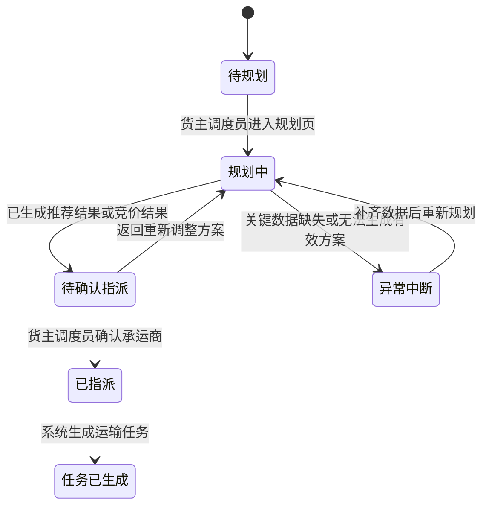

# 05 PRD 终稿

## 1. 文档信息

| 版本 | 日期 | 作者 | 修改说明 | 审核人 |
| :--- | :--- | :--- | :--- | :--- |
| v1.0 | 2026-05-20 | Easton / OpenCode | 收口货主侧“订单到承运商指派闭环”终版需求 | 待确认 |

## 2. 业务基线

- 业务目标：让货主调度员能够在统一工作台内完成订单接收、运输规划、承运商选择与运输任务生成，减少人工分散处理。
- 必要约束：本次只服务货主侧用户，不展开货代/承运商独立后台，不进入司机执行与签收回单闭环。
- 体验基线：页面表达必须围绕“控制塔视角 + 决策闭环”，让用户快速看清订单、推荐依据和指派结果。

## 3. 页面或模块详情

### 3.1 模块一：订单池 / 待规划列表

- 范围描述：承接来自 ERP/WMS 的待处理订单，作为货主调度员进入运输规划的统一入口。

#### 关键交互
- 支持按订单号、提货地、收货地、时效要求、运输方式进行筛选。
- 支持单选进入规划，也支持批量勾选后进入合并规划判断。
- 列表中必须优先展示：订单号、起讫地、重量/体积、时效要求、当前状态。

#### 页面反馈
- 若订单数量为 0，显示明确空状态，并提示“暂无待规划订单”。
- 若订单已被其他调度员锁定或正在规划，状态必须显著可见，避免重复处理。

#### 异常说明
- 若订单关键信息缺失，不允许直接进入推荐结果，必须先进入规划页补齐或标记不可规划。

### 3.2 模块二：运输规划页

- 范围描述：货主调度员对选定订单进行规划判断，包括整车、拆单、合单和推荐路径判断。

#### 关键交互
- 页面需分成：订单摘要区、规划判断区、承运商推荐区。
- 调度员可以查看订单是否适合整车直发，是否需要拆单，是否可与其他订单合并。
- 若存在多个规划方案，系统需展示方案差异，而不是只给一个黑盒结果。

#### 页面反馈
- 规划计算中需要展示明确的加载状态。
- 若规划结果生成成功，必须展示推荐方案数量和推荐依据摘要。

#### 异常说明
- 若无法形成有效方案，必须停留在当前页并明确说明原因，例如“重量超限”“无可用承运商”“时效要求无法满足”。

### 3.3 模块三：承运商推荐 / 竞价结果区

- 范围描述：为货主调度员展示可供选择的承运商候选，以及每个候选的推荐依据。

#### 关键交互
- 每个候选承运商至少展示：名称、成本、预计时效、运力状态、推荐原因。
- 推荐区支持在 2 到 3 个核心候选之间做横向比较。
- 若没有可用协议承运商，则进入竞价/招标结果区，但仍然保持同一页面主线，不跳散。

#### 页面反馈
- 默认按推荐优先级排序。
- 被系统推荐的承运商需要有显著标识，但仍允许人工切换其他候选。

#### 异常说明
- 如果推荐结果已过期，必须阻断确认动作，并提示刷新结果。
- 如果竞价结果不足以覆盖时效要求，必须提示人工介入，而不是默认继续提交。

### 3.4 模块四：确认指派动作

- 范围描述：由货主调度员确认承运关系，形成正式运输安排。

#### 关键交互
- 确认指派按钮应作为主动作按钮固定出现。
- 点击后必须触发二次确认，确认内容至少包括：订单数量、选中承运商、关键时效承诺。
- 二次确认通过后，系统才允许提交指派结果。

#### 页面反馈
- 提交中必须进入不可重复点击状态。
- 提交成功后必须给出明确成功反馈，并进入运输任务生成结果页。

#### 异常说明
- 若推荐结果变更、权限不足或数据已被他人更新，必须阻断提交，并留在当前上下文中。

### 3.5 模块五：运输任务生成结果

- 范围描述：指派完成后的结果确认区，用于让货主调度员确认本次闭环已经成立。

#### 关键交互
- 展示生成的任务编号、承运商名称、状态、下一步可跟踪入口。
- 提供“返回订单池”或“查看运输任务”的后续入口。

#### 页面反馈
- 结果页必须明确显示“已生成运输任务”。
- 若本次为批量指派，需说明生成了多少条任务、是否全部成功。

#### 异常说明
- 若任务生成部分失败，必须给出失败数量和失败原因，不允许只显示笼统失败。
- 若存在部分成功、部分失败的情况，结果页必须拆分展示“成功任务数”和“失败任务数”，并提供失败原因摘要。

### 3.6 状态流

### 3.7 全局交互说明

- 触发条件：订单从 ERP/WMS 同步进入订单池，状态进入“待规划”。
- 系统动作：系统支持货主调度员筛选订单、进入规划页、查看承运商推荐或竞价结果，并在确认后生成运输任务。
- 用户反馈：每一个关键动作都必须有明确反馈，包括进入规划页、生成推荐结果、确认指派成功、任务生成成功，以及异常阻断时的提示语。

### 3.8 异常处理矩阵

| 动作 | 触发条件 | 系统处理 | 精确反馈文案 |
| :--- | :--- | :--- | :--- |
| 进入运输规划 | 订单关键字段缺失（如提货地、到货地、时效要求） | 阻断进入规划结果区，保留在规划页并高亮缺失项 | `“当前订单信息不完整，无法生成运输方案，请先补齐关键字段。”` |
| 查看承运商推荐 | 无符合条件的协议承运商 | 进入竞价/招标备选分支或提示人工介入 | `“当前无符合条件的协议承运商，请改走竞价或人工指派流程。”` |
| 确认指派 | 推荐结果已过期或被其他人更新 | 阻断提交，要求刷新推荐结果 | `“当前推荐结果已变化，请刷新后重新确认承运商。”` |
| 生成运输任务 | 指派提交成功但任务生成失败 | 保留指派上下文，提示重试或人工处理 | `“承运商已确认，但运输任务生成失败，请重试或联系管理员处理。”` |
| 批量指派 | 多条订单中仅部分成功生成运输任务 | 保留本次批量上下文，拆分展示成功与失败结果 | `“本次批量指派部分完成：已成功生成 3 条任务，1 条失败，请查看失败原因后重试。”` |

## 4. 验收小结

1. 货主调度员可以从订单池中筛选订单并进入运输规划页。
2. 运输规划页可以展示至少一条可执行推荐结果，并说明推荐依据。
3. 确认指派后，系统必须明确反馈运输任务已生成，且状态对用户可见。
4. 若存在关键异常（数据缺失、无承运商、结果过期、任务生成失败），系统必须明确阻断并说明原因。

## 5. 修订说明

- 相比初稿：本次从完整 TMS 大蓝图收敛为货主侧单边使用的“订单到承运商指派闭环”。
- 本次主要变化：删除了司机执行、签收回单、费率对账等后续阶段内容，聚焦订单池、规划、推荐、指派、任务生成这 5 个关键节点。
- 当前审查状态：已形成可用于 demo 讲解与后续原型细化的终版说明。
