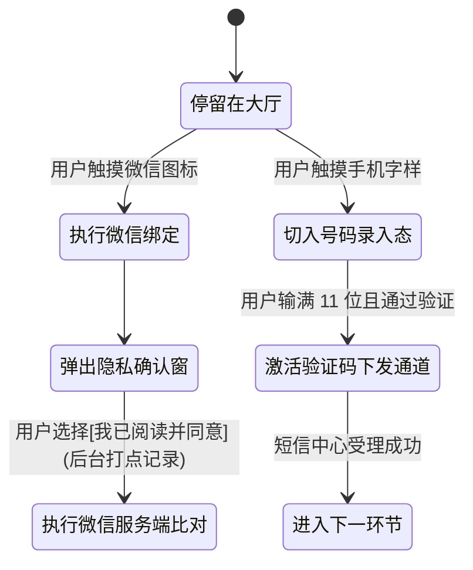
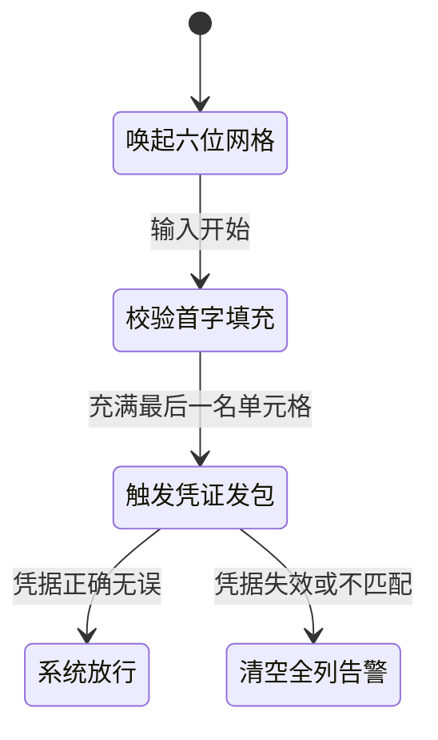
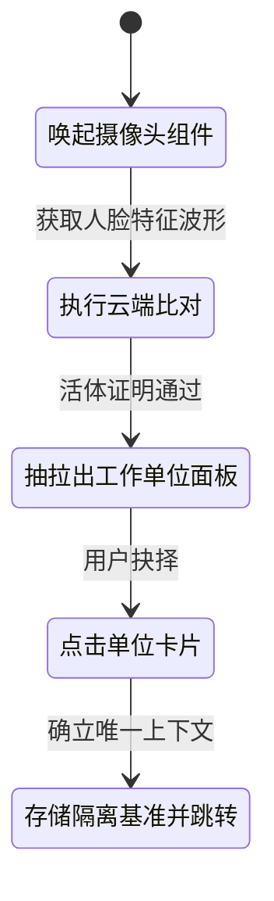

# 📑 TMS_Shipper 司机端鉴权与业务归属分发模块 - PRD_Final

## 1. 文档基本信息
| 文档版本号 | 日期 | 作者 | 修改描述 | 审核人 |
| :--- | :--- | :--- | :--- | :--- |
| v1.0 | 2026-04-02 | PM_Agent / 11_Inspector | 执行最终阶段技术脱水，剔除所有代码词汇，强制文案确定性闭环。 | Commander |

## 2. 核心架构与业务基线
- **业务定型**：支持物流多货主结算与派单的网关。所有司机在派单前必须确认真实身份及当前接单属于哪家货主。
- **业务防卷死线**：
  - 必须进行强制人脸比对，掐断非本人手机代挂。
  - 必须通过强制授权书勾选，否则阻断后续所有的系统发包动作。
- **界面要求**：不发生横向与纵向的界面折断、弹层不得突破指定的 375x812 物理容器大小。

---

## 3. 页面模块：首次登陆与授权大厅 (Screen_Lobby)

### 3.1 页面操作范围
承接整个 APP 首次打开或被动挤下线后的用户截留区。分化为微信一键确认、或输入实名手机号两大途径。

### 3.2 节点状态流

### 3.3 交互动作与焦点物理响应
- **隐私弹窗管控**：默认不勾选。若用户未勾选直接点击微信授权图标，界面拦截并物理高亮隐私协议的文字区域，伴随微震动。
- **号码输入框校验法则**：
  - 获取焦点瞬间唤起系统数字键盘。
  - 强制抹除用户输入和粘贴进来的全部英文字符、符号及空格。
  - 长度触达 11 位时，禁止继续拼写；若低于 11 位，发送验证码的按钮应呈现灰色不可点击状态。
- **行为采集点**：记录按钮的点击成功与流失漏斗事件。

### 3.4 “死穴”拦截与异常反馈矩阵
| 动作名 | 触发条件 | 执行动作（与后台交互） | 判定反馈与文案精确到字 |
| :--- | :--- | :--- | :--- |
| **下发验证码** | 点击获取短信按钮 | 向通信网关发送号码 | - **超频拦截**：如果对方网关判定今日超限，隐藏倒计时，弹出全局居中弹窗：`“您今日的获取次数已达上限，请15分钟后再试。”`（仅有确定的单按钮）。 - **网络崩溃**：界面出现加载占位轮廓长达 5 秒未收到确认，切断加载框，弹出 Toast 提示：`“当前网络拥塞，指令未发出，请检查信号。”` |

---

## 4. 页面模块：数字凭证校验面板 (Screen_OTP)

### 4.1 页面操作范围
校验前置接收到的 6 位短信数字凭据，以期换取系统的正式进入权限。

### 4.2 节点状态流

### 4.3 交互动作与焦点物理响应
- **悬浮格列响应**：必须拆分为 6 个独立的单次输入格子。
- **焦点追踪**：
  - 数字注入第 [N] 格瞬间，界面焦点物理跃迁至第 [N+1] 格。
  - 退格清零第 [N] 格瞬间，界面焦点物理回撤至第 [N-1] 格。
  - 当前处于活跃态的格位，周长应变幻为绿色悬浮光晕。

### 4.4 “死穴”拦截与异常反馈矩阵
| 动作名 | 触发条件 | 执行动作（与后台交互） | 判定反馈与文案精确到字 |
| :--- | :--- | :--- | :--- |
| **闭环发包验证** | 填满 6 个网格 | 将六位数值上报查验 | - **超时/凭证失效**：打断操作，弹出 Toast 提示：`“安全验证码已失效，请重新索取。”`并从当前操作区向左滑动退回至大厅页面。 - **高频乱打防暴**：如果服务端判定密码错误达 5 次，锁定输入框，红字警告：`“账号出现疑似风险，已被锁定。请联系所属车队队长解开。”` |

---

## 5. 页面模块：物理活体验证与所属货主面板 (Face_And_Tenant)

### 5.1 页面操作范围
核身是为校验当前操作员是名下的活人；货主面板是需要司机从多条可跑路线中，物理确立当前要进入那一家的工作流（财务结费完全隔离）。

### 5.2 节点状态流

### 5.3 交互动作与焦点物理响应
- **底部抽屉约束**：面板向上拉出时，必须压制在安全界限内，绝不可突破手机框架渲染导致的层级击穿或后退失效。
- **交互材质切换**：
  - 用户按下某一货主卡片时，背景色反转为主绿色调，并发生肉眼可见的回缩及扩散回弹反馈（物理化触动感）。

### 5.4 “死穴”拦截与异常反馈矩阵
| 动作名 | 触发条件 | 执行动作（与后台交互） | 判定反馈与文案精确到字 |
| :--- | :--- | :--- | :--- |
| **进入所属路线** | 明确点选归属卡片 | 提交货主专属串号核身 | - **幽灵名录熔断**：若选中一刹那恰逢管理员通过后台下架了这位司机的归属权，发生拒绝进入。清除抽屉，弹出强弹层（必须点确认方可消掉）：`“您的 [运货企业名] 承运准入资格刚刚发生变动，当前无法调度，请稍后刷新重试。”` - **硬件报销降级**：如果系统发觉底层摄像头已损毁报错，呼出底部备用操作单：`“硬件摄像头未能启动，点此跳转至人工调度人工拍照核准大厅”`。 |

---
*Generated & Audited by Inspector 11. (Tech-Vocabulary Cleared)*
