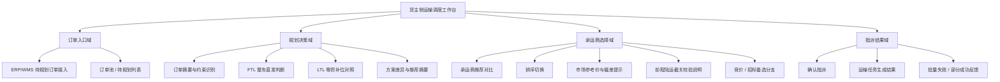

# 06 产品矩阵图

## 1. 说明

本文件用于沉淀 `v1.0` 当前版本的产品矩阵视图。

适用边界：

- 主使用方：货主侧调度员
- 主场景：工厂到工厂内贸运输
- 主闭环：订单进入 -> 运输规划 -> 承运商推荐 -> 确认指派 -> 运输任务生成
- 支线：前程陆运说明性规则

## 2. 产品矩阵总览

## 3. 矩阵表

| 领域 | 模块 | 当前作用 | `v1.0` 状态 |
| :--- | :--- | :--- | :--- |
| 订单入口域 | ERP/WMS 待规划订单接入 | 承接待处理订单进入调度工作台 | 主模块 |
| 订单入口域 | 订单池 / 待规划列表 | 订单筛选、状态判断、进入规划入口 | 主模块 |
| 规划决策域 | 订单摘要与约束识别 | 提炼起讫地、重量体积、时效要求等关键约束 | 主模块 |
| 规划决策域 | FTL 整车直发判断 | 作为主演示线给出规划结论 | 主模块 |
| 规划决策域 | LTL 零担补位对照 | 作为同页对照，不单独扩流程 | 对照模块 |
| 规划决策域 | 方案差异与推荐摘要 | 承接进入承运商推荐前的解释层 | 主模块 |
| 承运商选择域 | 承运商推荐对比 | 展示推荐依据和候选差异 | 核心模块 |
| 承运商选择域 | 排序切换 | 对比综合评分、价格、时效、KPI 视角 | 核心模块 |
| 承运商选择域 | 市场参考价与偏差提示 | 提升推荐透明度和可审计性 | 核心模块 |
| 承运商选择域 | 前程陆运截关校验说明 | 说明性支线规则，不扩成主线 | 支线模块 |
| 承运商选择域 | 竞价 / 招标备选分支 | 当无协议承运商时提供补充路径 | 备选模块 |
| 指派结果域 | 确认指派 | 由调度员完成最终承运确认 | 主模块 |
| 指派结果域 | 运输任务生成结果 | 显示闭环已成立 | 主模块 |
| 指派结果域 | 部分成功 / 失败反馈 | 提供异常闭环说明 | 支撑模块 |

## 4. 版本边界提醒

- `v1.0` 不包含司机执行端、在途跟踪、签收回单、费率对账。
- 前程陆运仅作为说明性支线，不得反客为主。
- 原型和评审中应优先突出“货主调度决策闭环”，而不是“大平台能力展示”。
