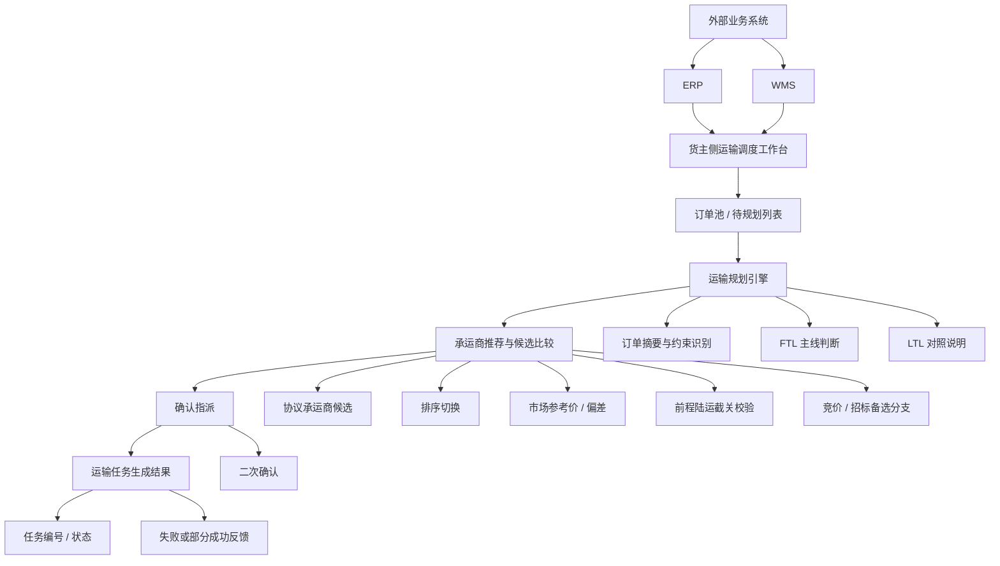

# 07 系统架构图

## 1. 说明

本文件用于沉淀 `v1.0` 的系统架构视图。

说明：

- 这里的“架构”以产品信息架构和业务交互关系为主
- 不展开底层部署、微服务、数据库等研发实现细节
- 架构视角服务于 demo、评审和后续主档合并

## 2. 架构范围

- 当前覆盖范围：货主侧国内陆运订单到承运商指派闭环
- 当前模块范围：订单接入、运输规划、承运商推荐、确认指派、任务结果反馈
- 当前不包含：司机执行、在途监控、回单签收、费率对账、经营分析

## 3. 系统架构图

## 4. 架构分层说明

| 分层 | 内容 | 当前职责 |
| :--- | :--- | :--- |
| 外部业务系统层 | ERP / WMS | 提供待规划订单输入 |
| 工作台入口层 | 订单池 / 待规划列表 | 统一承接调度入口，完成筛选和勾选 |
| 规划决策层 | 运输规划引擎 | 识别约束、给出 FTL / LTL 判断和推荐摘要 |
| 推荐决策层 | 承运商推荐与候选比较 | 展示候选、排序、规则说明、竞价分支 |
| 指派执行前层 | 确认指派 | 调度员完成最终确认 |
| 结果反馈层 | 运输任务生成结果 | 反馈闭环成立及异常状态 |

## 5. 架构约束

- 只服务货主侧调度员，不扩货代 / 承运商独立后台。
- 推荐层必须支持“综合评分优先”，并允许人工切换排序。
- 若为前程陆运说明场景，截关时间校验优先于低价候选展示。
- 被规则拦截的候选可保留为审计或风险候选，但不得与默认推荐候选平级。
- 结果层以“任务生成成功”作为主反馈，不扩成执行联动平台展示。
