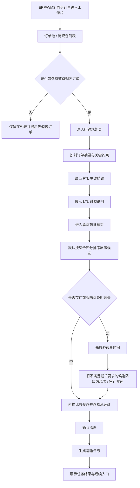
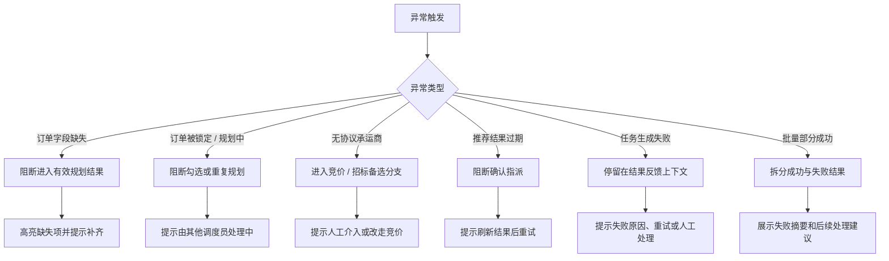
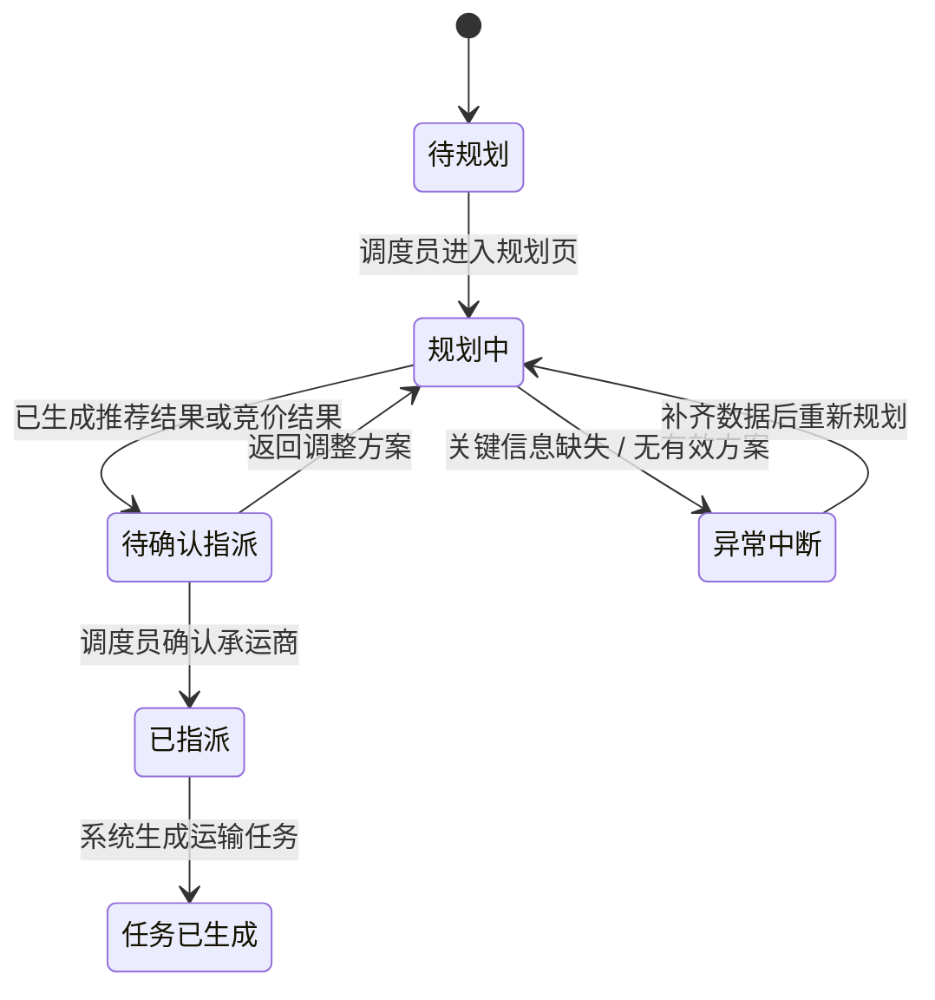

# 08 流程图

## 1. 说明

本文件用于沉淀 `v1.0` 当前版本的主流程图、异常流程图和状态流图。

## 2. 主流程图

## 3. 异常流程图

## 4. 状态流图

## 5. 流程边界说明

- 页面 1 重点是“哪些订单进入规划”，不是完整执行入口。
- 页面 2 重点是“为什么推荐整车”，不是复杂优化引擎展示。
- 页面 3 重点是“推荐依据透明”，不是全量竞价系统展示。
- 页面 4 重点是“闭环成立”，不是执行侧系统联动展示。
- 前程陆运只在页面 3 中以规则说明和候选降级逻辑出现，不作为独立主流程。
