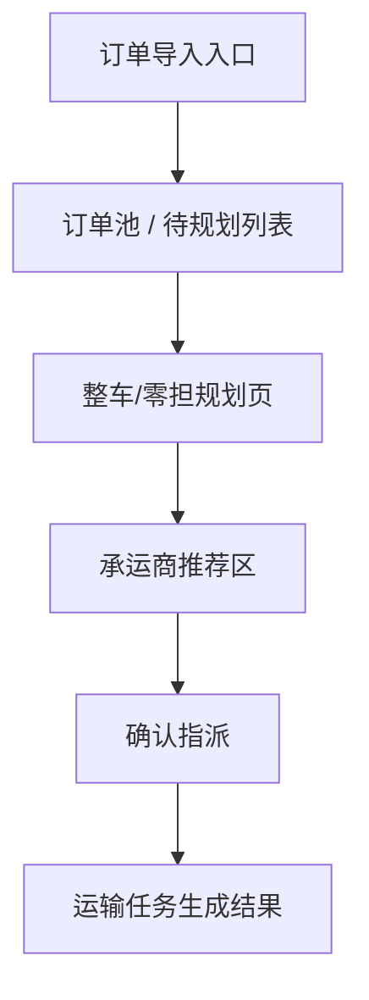

# v1.0 Demo Screenflow

## Screenflow Goal

用于说明 `v1.0` demo 的页面顺序和讲解主线。

## Flow Principles

- 主线必须完整走通一次，不要在页面之间来回跳散
- 页面顺序服务于“订单到承运商指派闭环”，不是服务全量 TMS 能力展示
- FTL 作为主演示线，LTL 只作为同页对照表达
- 前程陆运只作为规则说明支线，不形成独立跳转路径

## Demo Flow

## Screen-by-Screen Goal

| 页面节点 | 页面目标 | 讲解重点 | 输出结果 |
| :--- | :--- | :--- | :--- |
| 订单导入入口 | 说明订单来源 | ERP/WMS 同步进入待规划池 | 进入订单池 |
| 订单池 / 待规划列表 | 说明哪些订单进入规划主线 | 筛选、状态、运输类型标签 | 选中订单进入规划 |
| 整车/零担规划页 | 说明为什么需要规划判断 | FTL 主线、LTL 对照、方案差异 | 产出推荐方案 |
| 承运商推荐区 | 说明推荐依据可信 | 综合评分、报价、时效、KPI、排序切换 | 选定承运商 |
| 确认指派 | 说明最终决策确认 | 二次确认、关键时效承诺 | 提交指派 |
| 运输任务生成结果 | 说明闭环已经完成 | 任务编号、状态、后续入口 | 形成任务结果 |

## Scene Notes

- 主线：工厂到工厂内贸运输
- FTL：主演示线
- LTL：同页对照区块
- 前程陆运：规则说明支线

## Side Branch Placement

- 建议放置位置：承运商推荐区或订单摘要区
- 建议表达方式：场景标签、推荐原因提示、规则说明文案
- 建议说明力度：一句规则 + 一个受影响候选示例即可，不再单独展开更多页面

## Transition Notes

1. 从订单池进入规划页时，要强调这是从订单筛选转入决策阶段。
2. 从规划页进入推荐区时，要强调推荐建立在规划判断之后，而不是平铺报价列表。
3. 从推荐区进入确认指派时，要强调系统推荐不等于自动拍板。
4. 从确认指派进入结果页时，要强调本次演示闭环已经完成。

## What Not To Expand

- 司机执行端
- 在途监控完整流程
- 签收回单闭环
- 费率对账闭环

## Next Asset Handoff

- 若继续落图，下一步优先产出按页面拆分的 `Page Spec`
- 若继续补文案，下一步优先产出按页面拆分的 `Screen Content`
- 若直接画图，建议先按本文件顺序完成 4 个主页面草图
