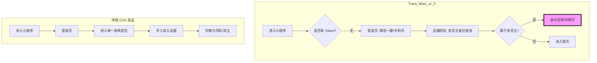

# 📡 Phase 2: 竞品雷达调研报告 (Competitor Research)

> **给指挥官的决策摘要**：
> 调研表明，B2B 物流标杆（如顺丰、货拉拉企业版）的核心竞争力在于**“极速身份识别”**与**“多角色平滑切换”**。我们将参考顺丰的“综合身份治理”模型，并结合 Trans_Wise 的 AI 属性，通过“邀请即绑定”的自动化流实现降维打击。

## 1. 标杆对标 (Top Players Analysis)

| 竞品 | 登录/激活模式 | 身份切换交互 | 亮点/可借鉴点 |
| :--- | :--- | :--- | :--- |
| **货拉拉 (Huolala)** | 手机号+验证码/微信授权 | 侧边栏/个人中心手动切换“货主/司机” | 极简的手机号一键登录，注册流极短。 |
| **顺丰速运 (SF Express)** | 微信静默登录+手机号对齐 | 顶部/中段显眼的“切工作区/切身份”组件 | 支持多企业账号关联，企业实名认证流非常稳健。 |
| **Flexport (Mobile)** | SSO/账号密码 | 底部 Tab 栏直接区分业务视角 | 深度集成企业 ERP，登录后根据角色自动路由。 |

## 2. 核心交互逻辑对比 (Mermaid Visualization)

## 3. 避坑审计 (The Pitfall Audit)

根据开发者社区及用户反馈，我们必须绕开以下坑位：
- **坑 1：强制人脸识别导致的阻断**。微信原生人脸识别对行业资质要求极严。若无资质强行开发，会导致审核被拒。
  - **Trans_Wise 策略**：1.0 预留 2FA 接口，优先使用短信验证码作为安全兜底，针对特定资质货主开启三方人脸插件。
- **坑 2：邀请链接实效性/丢失**。用户点击邀请链接进入登录页，未登录前退出，再次进入时丢失溯源 ID。
  - **Trans_Wise 策略**：在 `onLaunch` 时将邀请人 ID 写入本地持久化缓存，直至注册流程彻底闭环。

## 4. 差异化竞争建议 (Trans_Wise Edge)

1.  **AI 自动化入驻 (Auto-Onboarding)**：
    通过邀请链接注册后，系统不仅自动关联货主，还应利用后端已有的货主排产数据，在登录成功后立即推送“第一单建议”，将“注册”直接转化为“生产力”。
2.  **软引导授权恢复机制**：
    若用户拒绝微信手机号授权，页面不应报错，而是切换为“图形验证码 + 手机号”的手动录入模式，并以“安全保障”为文案进行软性引导。

## 5. 信源追溯 (Source Tracking)
- [微信小程序人脸核身接口文档](https://developers.weixin.qq.com/community/business/doc/000442d35441b830d9283737c56009)
- [货拉拉/顺丰小程序登录流剖析 (2025-2026 调研)](https://www.woshipm.com/)

---
**[进度播报]**：调研完毕。业务与竞争逻辑已清晰。
**是否授权开启 Phase 3 (需求初稿蓝图)？** 我将开始编写 PRD 并定义身份切换的状态机。
